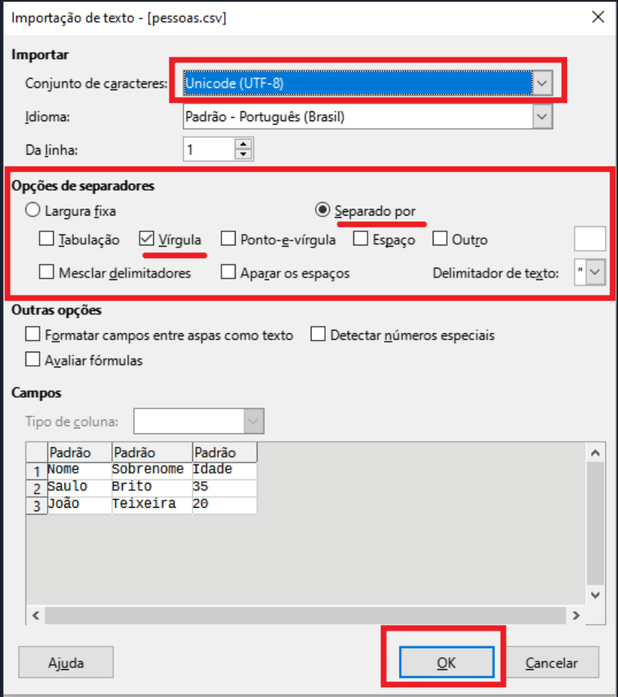

[](https://zenodo.org/doi/10.5281/zenodo.10078840) <a rel="license" href="http://creativecommons.org/licenses/by-nc/3.0/"></a><br />This work is licensed under a <a rel="license" href="http://creativecommons.org/licenses/by-nc/3.0/">Creative Commons Attribution-NonCommercial 3.0 Unported License</a>.


# CSV2RMD: um script em python para criar arquivos RMD de dicionário (html ou pdf) a partir de arquivo(s) csv.

Por favor use a referência seguinte para citar o programa em qualquer publicação que resulte de seu uso:

BRITO, Saulo; BIRCHALL, Joshua; GALÚCIO, Ana Vilacy. 2024. **Csv2rmd**: Um programa python para produzir dicionário multimídia com Markdown. Versão 1.0. Belém: Museu Paraense Emílio Goeldi. DOI: https://zenodo.org/doi/10.5281/zenodo.10078840.

# Introdução  

A documentação de línguas é uma tarefa importante e desafiadora. É fundamental ter uma documentação precisa e abrangente das línguas para preservá-las e mantê-las vivas. Essa documentação muitas vezes envolve a coleta de dados linguísticos, que podem incluir palavras, frases, gramática e vocabulário, entre outros.  

Para documentar essas informações, é comum a utilização de diversos formatos, que podem ser práticos na manipulação, mas difíceis de serem organizados e formatados. A criação de dicionários e outros recursos linguísticos pode ser um processo demorado e complicado, especialmente para línguas menos conhecidas ou com poucos recursos disponíveis.  

É necessário apresentar essas informações de maneira estruturada e organizada, em um formato que permita fácil compartilhamento e acesso, muitas vezes como uma ferramenta para a manutenção e o uso contínuo da língua.  

A metodologia para elaboração de dicionários multimídia apresentada neste documento foi desenvolvida em torno do uso do script CSV2RMD, uma ferramenta inicialmente projetada para gerar arquivos .rmd no formato Markdown a partir de tabelas contendo informações linguísticas vinculadas a arquivos de mídia. Atualmente, o script evoluiu e é capaz de produzir diretamente arquivos HTML de dicionários multimídia, utilizando Markdown apenas em alguns processos internos. Essa ferramenta é utilizada na criação de dicionários multimídia para línguas indígenas. 

O fluxo de trabalho com o script **CSV2RMD.py** pode ser dividido em três etapas distintas:  

a) **Preparação dos dados e metadados**;  
b) **Uso do script**;  
c) **Criação de produtos**.  

Cada uma dessas etapas pode ser subdividida em outras atividades, como podemos observar na imagem a seguir. É importante destacar que as atividades descritas não consideram os processos anteriores, que envolvem a coleta de material linguístico pelos pesquisadores.  


Na **preparação dos dados e metadados**, é necessário organizar os arquivos em pastas específicas para cada tipo de mídia (foto, vídeo, áudio), seguindo suas respectivas nomenclaturas e preenchendo uma planilha no formato CSV. Cada linha dessa planilha corresponde a uma entrada lexical no dicionário e inclui o nome dos arquivos de mídia armazenados nas pastas, realizando a conexão entre cada entrada do dicionário e os arquivos a ela relacionados.  

Na etapa de **configuração e verificação**, o primeiro passo é utilizar a opção **"1 - Validar tabela ('dicionário.csv')"**. Essa função verifica se há itens essenciais ausentes na tabela (validação de campos) e identifica problemas relacionados aos arquivos (validação de arquivos). Todas as informações geradas durante o processo de validação, incluindo algumas totalizações, são exportadas como um arquivo de texto (**.txt**) na pasta de trabalho.  

Após a validação, é possível preencher arquivos de configuração que permitem adicionar uma introdução e referências aos produtos.  

Na etapa de **criação de produtos**, é possível gerar os formatos desejados, como **HTML** ou **PDF**, a partir do script que combina as informações da tabela e as mídias para gerar esses produtos (utilizando ferramentas internas com auxílio de linguagens como **HTML** e **LaTeX**).  

No caso do HTML, o arquivo pode, posteriormente, ser transformado em uma aplicação Android com o uso de uma ferramenta adicional. Esse processo evidencia a natureza cíclica da produção: os produtos podem passar por revisões, seja pelos próprios criadores ou pela comunidade a que se destinam, reiniciando o ciclo para futuras versões aprimoradas.


## Tecnologias Utilizadas

Este projeto faz uso de várias bibliotecas, linguagens e sistemas para garantir um processo robusto e eficiente na criação e manipulação de dicionários multimídia. Abaixo estão listadas as principais bibliotecas, linguagens e ferramentas empregadas no projeto, excluindo aquelas que já fazem parte da instalação padrão do Python:

- **Linguagem de Programação**:
  - **[Python](https://www.python.org/)**: linguagem de programação versátil e amplamente utilizada para manipulação de dados, automação e criação de scripts.

- **Bibliotecas Python**: 
  - [`pandas`](https://pandas.pydata.org/): para manipulação e análise de dados tabulares.
  - [`markdown2`](https://github.com/trentm/python-markdown2): para conversão de arquivos Markdown para HTML.
  - [`inquirer`](https://github.com/magmax/python-inquirer): para criação de menus interativos no terminal.
  - [`pympi.Elan`](https://github.com/dopefishh/pympi): para manipulação de arquivos `.eaf` de anotações multimodais.
  - [`tqdm`](https://tqdm.github.io/): para adicionar barras de progresso em loops.
  - [`pydub`](https://pydub.com/): para edição de arquivos de áudio.
  - [`PIL` (Pillow)](https://pillow.readthedocs.io/en/stable/): para manipulação de imagens.

- **Ferramentas Externas**:
  - **[FFmpeg](https://ffmpeg.org/)**: ferramenta poderosa para processamento e conversão de vídeos e áudios.
  - **[LaTeX](https://www.latex-project.org/)**: sistema para geração de documentos, especialmente utilizado para criação de dicionários e outras publicações científicas.
  - **[MiKTeX](https://miktex.org/)**: distribuição de LaTeX utilizada para compilar e gerar documentos em formato PDF a partir de código LaTeX.

- **Outras Tecnologias**:
  - **[HTML5](https://developer.mozilla.org/en-US/docs/Web/HTML)**: para construção da interface do dicionário multimídia.
  - **[CSS](https://developer.mozilla.org/en-US/docs/Web/CSS)**: utilizado para estilização e personalização da aparência das páginas HTML geradas.
  - **[JavaScript](https://developer.mozilla.org/en-US/docs/Web/JavaScript)**: linguagem de programação essencial para criar funcionalidades interativas e dinâmicas nas páginas web do dicionário, como a manipulação de eventos, formulários dinâmicos e animações.

Essas ferramentas foram escolhidas pela sua robustez e flexibilidade, permitindo a manipulação eficiente de dados, o processamento e a criação de dicionários digitais multimídia. Sem elas, todo o trabalho até aqui desenvolvido seria muito mais complexo e demorado.


## Ambiente de Trabalho CSV2RMD  

Para utilizar o script **CSV2RMD**, você precisará preencher as informações lexicais do seu dicionário em uma planilha no formato **.csv** e organizar as mídias referentes a essas entradas em pastas específicas, separando-as por tipo (**foto**, **áudio** e **vídeo**). Tanto a planilha quanto as pastas de mídia devem estar na mesma pasta onde você executará o script, responsável por transformar as informações contidas na pasta em um documento **HTML** ou **PDF** de dicionário.  

Dentro da pasta de trabalho do script, você deverá ter os seguintes arquivos/pastas:  

- **Pasta "audio"**: Contém os arquivos de áudio referenciados na planilha do dicionário.  
- **Pasta "foto"**: Armazena os arquivos de imagem referenciados na planilha do dicionário.  
- **Pasta "video"**: Contém os arquivos de vídeo referenciados na planilha do dicionário.  
- **Arquivo "dicionario.csv"**: Planilha contendo informações relacionadas às entradas lexicais do dicionário.  
- **Scripts (CSV2RMD e/ou TRATAR-MIDIAS)**: Arquivos Python responsáveis por gerar os dicionários ou auxiliar na preparação das mídias.  


## Fluxo de Trabalho na Elaboração de Dicionários Multimídia  

O fluxo de trabalho com o **CSV2RMD** envolve várias etapas distintas e pode ser iniciado a partir de dois cenários:  

1. **Arquivos de mídia já recortados** ou que serão recortados manualmente, utilizando um programa ou script próprio.  
2. **Arquivos de áudio que serão recortados** usando o script de mídia distribuído com o CSV2RMD.  

### Cenário 1: Arquivos de Mídia Recortados Manualmente  
Para iniciar, será necessário criar uma tabela padrão chamada **“dicionário.csv”** vazia (que pode ser gerada utilizando o script CSV2RMD). Essa tabela será preenchida linha por linha com as informações de cada item lexical. Cada linha conterá, além das informações do item, o nome dos arquivos correspondentes, que deverão ser adicionados às pastas de mídia (**foto**, **áudio** e **vídeo**) e posteriormente utilizados para criar as entradas do dicionário.  

### Cenário 2: Recorte de Mídias com Arquivos .eaf  
É possível utilizar arquivos de transcrição no formato **.eaf** para recortar as mídias e gerar uma tabela preliminar do dicionário, com algumas informações preenchidas automaticamente. Esses dados são extraídos do preenchimento padrão utilizado nos arquivos **.eaf**. (Consulte a seção sobre recorte de áudios no script de tratamento de mídias para mais detalhes).  


### Ajustes e Finalização  

Após preencher a tabela com os dados referentes aos itens lexicais e organizar os arquivos de mídia em suas respectivas pastas, você poderá realizar ajustes adicionais utilizando o script **TRATAR-MIDIAS**. Esse script permite:  

- **Reduzir o bitrate** dos áudios para otimizar o tamanho dos arquivos.  
- **Ajustar imagens** que estejam fora do padrão estabelecido.  

Embora opcionais, essas etapas são recomendadas, pois ajudam a criar produtos mais organizados e otimizados.  

Com os pré-requisitos atendidos, as mídias organizadas e a tabela preenchida, você poderá utilizar o script **CSV2RMD** para revisar a tabela **“dicionário.csv”** e gerar os produtos finais.  

Nos próximos capítulos, serão abordados os seguintes passos:  
- Uso do **script de tratar mídias**;  
- Configuração do arquivo **“dicionário.csv”**;  
- Utilização do **script CSV2RMD** para gerar os dicionários.  

# O Arquivo "dicionario.csv"

O arquivo **"dicionario.csv"** é um documento de texto com valores separados por vírgula (**CSV**), que pode ser aberto e editado em qualquer editor de planilhas comumente utilizado. Para evitar problemas de conversão ao abrir a planilha, recomenda-se o uso do **LibreOffice**.  

### Configurações Básicas  
Ao abrir o arquivo CSV no LibreOffice, é importante atentar-se a algumas configurações específicas:  

  

### Estrutura do Arquivo  
As entradas no arquivo são inseridas linha por linha, e cada linha representa uma entrada lexical com um de seus possíveis significados.  

#### Campos Obrigatórios:  
- **Item Lexical**: O termo principal ou a palavra incluída no dicionário.  
- **Tradução ou Significado**: A tradução ou o significado do item lexical em outro idioma. Recomenda-se iniciar com letra minúscula.  
- **Campo Semântico**: A área temática ou categoria à qual o item lexical está relacionado, ajudando a agrupar termos similares.

#### Campos Opcionais:  
- **Arquivo Sonoro**: Nome do arquivo de áudio associado ao item lexical, conforme está na pasta de mídias.  
- **Classe Gramatical**: Categoria gramatical do item lexical, como verbos, substantivos ou adjetivos. Use abreviações como "v" (verbo), "s" (substantivo), "adj" (adjetivo), etc.  
- **Transcrição Fonêmica**: Representação dos sons distintivos do item lexical, usando símbolos fonêmicos.  
- **Transcrição Fonética**: Representação detalhada da pronúncia, incluindo nuances e alofones.  
- **Descrição**: Explicação detalhada do item lexical. Recomenda-se iniciar com letra maiúscula.  
- **Arquivo de Imagem**: Nome do arquivo de imagem associado, conforme está na pasta de mídias. Pode ser uma ilustração ou fotografia.  
- **Subcampo Semântico**: Subdivisão dentro do campo semântico, proporcionando uma classificação mais detalhada.  
- **Arquivo Sonoro de Exemplo**: Nome do arquivo de áudio contendo um exemplo, conforme está na pasta de mídias.  
- **Arquivo de Vídeo de Exemplo**: Nome do arquivo de vídeo contendo um exemplo, conforme está na pasta de mídias.  
- **Transcrição do Exemplo**: Transcrição de um exemplo relacionado ao item lexical, no sistema ortográfico da língua.  
- **Tradução do Exemplo**: Tradução do exemplo em outro idioma.  

### Recomendações  
É recomendado que, ao adicionar arquivos de som, sejam incluídas as respectivas traduções e transcrições para melhor compreensão e organização dos dados.


## Casos Especiais de Preenchimento da Tabela

### Múltiplos Exemplos  
Para incluir múltiplos exemplos em nosso modelo de dicionário, alguns campos da tabela são diretamente associados:  
- **Transcrição do Exemplo**  
- **Tradução do Exemplo**  
- **Arquivo Sonoro do Exemplo**  
- **Arquivo de Vídeo**  

#### Uso de Barra Vertical (`|`)  
Para adicionar mais de um exemplo, utilize o caractere especial **barra vertical** (`|`). Assim, é possível incluir dois ou mais elementos em uma única célula. O script reconhecerá múltiplos elementos desde que a barra vertical esteja presente para separá-los.  

**Exemplo de preenchimento correto:**  
Arquivo som exemplo 1 | Arquivo som exemplo 2
Transcrição 1 | Transcrição 2
Tradução 1 | Tradução 2

**Importante:** Todos os campos relacionados a exemplos em uma mesma linha devem conter o mesmo número de barras verticais. Mesmo que um exemplo não tenha arquivo de som, deve-se inserir a barra para manter a consistência.  

**Exemplo:**  
Arquivo som exemplo 1 |
Transcrição 1 | Transcrição 2
Tradução 1 | Tradução 2

Ao seguir essas regras, é possível adicionar quantos exemplos forem necessários para cada entrada.

### Variações Lexicais  
Os campos relacionados a variações lexicais são:  
- **Item Lexical**  
- **Transcrição Fonêmica**  
- **Transcrição Fonética**  
- **Arquivo Sonoro**  

#### Uso de Barra Vertical (`|`)  
Para incluir múltiplas variantes, também use a **barra vertical** (`|`). Assim, diferentes variantes de um mesmo item podem ser inseridas em uma única célula.

**Exemplo de preenchimento correto:**  
Item Lexical 1 | Item Lexical 2
Transcrição Fonêmica 1 | Transcrição Fonêmica 2
Transcrição Fonética 1 | Transcrição Fonética 2

 **Atenção:** Todos os elementos relacionados às variantes devem ter o mesmo número de barras verticais, mesmo que uma variante não tenha arquivo sonoro.


### Múltiplos Significados  
Embora raro, pode haver palavras com múltiplos significados. Neste caso, cada significado será inserido em linhas separadas da tabela, mas com os mesmos campos básicos preenchidos:  
- **Item Lexical**  
- **Classe Gramatical**  
- **Campo Semântico**  
- **Subcampo Semântico**  

#### Organização:  
O script unificará as linhas como uma única entrada, numerando os significados distintos.

**Exemplo:**  
Item Lexical | Classe Gramatical | Campo Semântico | Subcampo Semântico | Tradução 1
Item Lexical | Classe Gramatical | Campo Semântico | Subcampo Semântico | Tradução 2


# Script **TRATAR-MÍDIAS**

O script **TRATAR-MÍDIAS** é uma ferramenta criada a partir da integração de diversos scripts desenvolvidos anteriormente, com o objetivo de **facilitar a organização e o tratamento das mídias** utilizadas no dicionário. Ele permite realizar várias tarefas essenciais, como:

- **RECORTAR ÁUDIO**: Recorta áudios de palavras a partir da transcrição em linhas específicas de arquivos **.EAF** e gera um arquivo **.csv** com os áudios recortados.
- **Reduzir bitrate**: Diminui o bitrate dos arquivos de áudio, reduzindo o tamanho dos arquivos que possuem qualidade excessiva para fins de divulgação.
- **Padronizar imagens**: Ajusta imagens que excedem o tamanho recomendado para um padrão definido e identifica imagens menores que o ideal, sinalizando-as para substituição.

## Pré-requisitos (somente Python)

Para utilizar o script, você precisará dos seguintes componentes:

- **FFmpeg**: Certifique-se de que o **FFmpeg** está instalado no sistema ou que a pasta **ffmpeg**, fornecida junto com o script, esteja presente no diretório de execução.
- **Python**: Verifique se o **Python** está instalado no seu sistema.
- **Bibliotecas Python**: Certifique-se de que as seguintes bibliotecas estão instaladas: **pydub**, **pympi-ling**, **pandas**, **tqdm** e **Pillow**.

### Instalação das bibliotecas (Caso você não tenha feito anteriormente)

Após instalar o **Python** e reiniciar o computador, execute o comando abaixo no CMD (ou a ferramenta correspondente em seu sistema) para instalar as bibliotecas necessárias:

```bash
pip install pydub pympi-ling pandas tqdm pillow
```         

Após o download e a instalação, as bibliotecas estarão prontas para uso.


## Backup das Pastas de Mídia

Sempre que o script for iniciado, antes de apresentar as opções de uso, um **Cópia das pastas de Mídia** será exibido. Esse menu permitirá que você faça uma cópia das pastas de mídia (**"audio"**, **"foto"** e **"video"**) antes de realizar qualquer edição nos arquivos.

### Funcionamento do Backup:

- **Criação da Pasta de Backup**:  
  Se optar por fazer o backup, uma pasta chamada **"brutos"** será criada. Dentro dela, será gerada uma subpasta com um nome composto pela **data e hora** da execução do script, seguido da palavra **"copia"**.

- **Movimentação de Arquivos**:  
  Sempre que uma modificação for realizada utilizando o script, os arquivos originais são automaticamente transferidos para a pasta **"brutos"**. Assim, o backup inicial só precisa ser feito quando você desejar criar uma **cópia geral e datada** das três pastas principais de mídia.

#### Recomendações:

Utilize essa opção quando quiser garantir uma cópia completa e organizada das pastas de mídia antes de realizar alterações.


## Diminuir Bitrate

A opção de **diminuir o bitrate** é útil quando o dicionário produzido contém áudios com qualidade superior à necessária para divulgação, resultando em arquivos muito grandes. Essa opção reduzirá o bitrate de todos os áudios na pasta **"audio"**. Os formatos suportados são **.wav** e **.mp3**.

**IMPORTANTE**: A redução do bitrate pode afetar a qualidade do áudio. Todos os áudios processados por esta opção serão **convertidos para MP3**, exigindo uma atualização na planilha do dicionário caso existam arquivos em formato **.wav**.


### Instruções de Uso:

1. **Preparação dos Arquivos**:  
   Coloque os arquivos de áudio que deseja converter na pasta **"audio"**, localizada no mesmo diretório do script Python.

2. **Abrir o Terminal**:  
   Abra um terminal ou prompt de comando e navegue até o diretório onde o script está localizado (no caso da versão Python).

3. **Executar o Script**:  
   - Para a versão **EXE**, execute o arquivo diretamente.  
   - Para a versão **Python**, use o seguinte comando:  
     ```bash
     python TRATAR-MIDIAS.py
     ```

4. **Backup Opcional**:  
   O script perguntará se você deseja fazer uma cópia das mídias antes de continuar. Responda conforme a sua necessidade.

5. **Selecionar a Opção**:  
   Escolha a opção **[1] - Diminuir bitrate** no menu.

6. **Definir o Bitrate**:  
   O script solicitará que você insira o bitrate desejado para a conversão. Digite o valor em **kbps** (exemplo: `128` para 128 kbps).

7. **Processamento**:  
   O script processará os arquivos de áudio, convertendo-os para o bitrate especificado.

8. **Localização dos Arquivos**:  
   Os arquivos convertidos serão armazenados na pasta **"audio"**, enquanto os originais serão movidos para a pasta **"brutos"**.

9. **Acompanhamento**:  
   Durante a conversão, o script exibirá mensagens indicando o progresso e quais arquivos foram convertidos com sucesso.

10. **Finalização**:  
    Após a conclusão, o script informará que a tarefa foi concluída. 


Observações:

- Certifique-se de que todos os arquivos de áudio que deseja converter estejam na pasta **"audio"** antes de iniciar o script.  
- Caso algum arquivo não possa ser convertido, o script exibirá uma mensagem informando o problema.


## Cortar Áudio de Palavras e Exemplos de Uso

A segunda opção do script **Tratar Mídias** foi desenvolvida para recortar vários arquivos de áudio com base em referências de arquivos **EAF** (ELAN Annotation Format). Ela permite a geração de recortes de áudio para palavras e frases específicas, além de criar uma tabela no formato **CSV2RMD**. 

### Requisitos das Trilhas de Transcrição:

Para que o script funcione corretamente, as trilhas de transcrição do arquivo de anotação ELAN devem conter os seguintes elementos em seus nomes:

- **`_Transcription-`**: Transcrição fonética.
- **`_Translation-gls-pt`**: Tradução ou significado.
- **`_Orthography-`**: Item lexical e exemplos.
- **`CSV2RMD`**: Anotações de nome e referências de exemplos (usadas nos nomes dos recortes).

Na trilha **CSV2RMD**, faça anotações apenas nos trechos que precisam ser exportados. O nome inserido nesses trechos será utilizado tanto no nome dos arquivos quanto na tabela gerada.

### Exemplo de Nomeação:

- Se o nome do arquivo de áudio for `SKF-20190125-AVG-RB-manufatura` e o nome definido na trilha **CSV2RMD** for `cesto`, o arquivo exportado será nomeado como `SKF-20190125-AVG-RB-manufatura-cesto`.
  
- Para definir exemplos de uma palavra, adicione o sufixo `-ex`.  
  Exemplo: Para uma frase que seja exemplo para "cesto", insira **`cesto-ex`**.  

- Para usar a mesma frase como exemplo de várias palavras, separe os nomes com **|**. Exemplo: `cesto-ex|casa-ex`.

Essas associações serão utilizadas para gerar uma tabela chamada **dicionario.csv**, que facilitará o preenchimento e a produção de dicionários.


### Instruções de Uso:

1. **Preparação dos Arquivos**:  
   Coloque os arquivos de áudio (WAV ou MP3) junto com seus arquivos **EAF** correspondentes em uma pasta chamada **"eaf"** no mesmo diretório do script.  
   > **Atenção**: Os arquivos de áudio e **EAF** devem ter exatamente o mesmo nome (com exceção da extensão).

2. **Abrir o Terminal**:  
   Abra um terminal ou prompt de comando e navegue até o diretório onde o script está localizado (somente para versão em python).

3. **Executar o Script**:  
   - Para a versão **EXE**, execute o arquivo diretamente.  
   - Para a versão **Python**, use o seguinte comando:  
     ```bash
     python TRATAR-MIDIAS.py
     ```

4. **Backup Opcional**:  
   O script perguntará se você deseja fazer uma cópia das mídias antes de continuar. Responda conforme necessário.

5. **Selecionar a Opção**:  
   Escolha a opção **[2] - Cortar áudio** no menu.

6. **Escolher Formato de Exportação**:  
   - Digite **1** para exportar os recortes em **WAV**.  
   - Digite **2** para exportar em **MP3**.

7. **Processamento**:  
   O script processará os arquivos **EAF** e associará as transcrições aos trechos de áudio correspondentes.

8. **Exportação dos Recortes**:  
   Os recortes de áudio serão armazenados na pasta **"audio-novo"** no formato escolhido.

9. **Geração da Tabela**:  
   O script criará um arquivo CSV chamado **dicionario.csv** com as informações organizadas e a data/hora da execução no nome.

10. **Finalização**:  
    Após a conclusão, o script informará que a tarefa foi concluída. 


Observações Importantes:

- Certifique-se de que todos os arquivos de áudio e **EAF** tenham nomes correspondentes.  
- Cada arquivo **EAF** deve ter somente um arquivo de áudio correspondente na pasta.
- Evite caracteres especiais e espaços nos nomes das anotações na trilha **CSV2RMD** para evitar erros.


## Padronizar Imagens

A opção **Padronizar Imagens** ajuda a manter um tamanho uniforme nas imagens, facilitando a visualização e organização das entradas do dicionário. Além disso, o script verifica se as imagens são pequenas demais para telas grandes. Os formatos suportados são **PNG** e **JPEG**.

### Parâmetros de Tamanho Utilizados:

- **Paisagem**:  
  - Largura: 690px  
  - Altura: 500px  

- **Retrato**:  
  - Largura: 450px  
  - Altura: 650px  

- **Quadrada**:  
  - Largura: 500px  
  - Altura: 500px  

- **Tamanho Mínimo**:  
  - Largura: 400px  
  - Altura: 400px  


### Instruções de Uso:

1. **Preparação dos Arquivos**:  
   Coloque as imagens que deseja processar na pasta **"foto"** no mesmo diretório do script.

2. **Abrir o Terminal**:  
   Abra um terminal ou prompt de comando e navegue até o diretório do script (somente para a versão Python).

3. **Executar o Script**:  
   - Para a versão **EXE**, execute o arquivo diretamente.  
   - Para a versão **Python**, use o comando:  
     ```bash
     python TRATAR-MIDIAS.py
     ```

4. **Backup Opcional**:  
   O script perguntará se deseja fazer uma cópia das mídias antes de continuar. Responda conforme necessário.

5. **Selecionar a Opção**:  
   Escolha a opção **[3] - Ajustar Imagens** no menu.

6. **Processamento**:  
   O script executará as seguintes ações:
   
   - Redimensionará as imagens de acordo com os parâmetros especificados utilizando um fundo branco quando necessário, mantendo-as na pasta **"foto"**.
   - Moverá as imagens originais para a pasta **"brutos"**.
   - Moverá as imagens com dimensões menores que o tamanho mínimo para a pasta **"pequenas"** dentro da pasta **"foto"**.

7. **Feedback Durante o Processo**:  
   O script exibirá informações sobre o tipo de imagem (paisagem, retrato ou quadrada) e suas dimensões antes e depois do redimensionamento.

8. **Finalização**:  
   Ao concluir o processo, o script informará que a tarefa foi finalizada com sucesso.


# O script CSV2RMD

O fluxo de trabalho relacionado especificamente com a criação dos produtos com o script **CSV2RMD** geralmente envolve duas etapas principais: **Validar a tabela** e **Gerar um produto**. 

Portanto, é provável que você precise executar o script pelo menos duas vezes:

1. **Primeira execução**: Para verificar possíveis problemas com a tabela em relação às mídias e campos obrigatórios. Para isso, utilize a opção: **Validar tabela** (`dicionario.csv`).
2. **Segunda execução**: Para gerar o produto final, usando uma das opções disponíveis, como **Gerar PDF** ou **Gerar HTML**.

Além dessas opções, você também pode executar o script para:

- **Gerar um arquivo de configuração** para inserir uma introdução ou referência (apenas para HTML) no seu produto final.
- **Gerar uma tabela padrão** para iniciar o preenchimento dos dados.


## Pré-Requisitos

O script está disponível em dois formatos:

- **Versão Python**:  
  Desenvolvida originalmente para execução em qualquer sistema operacional compatível com Python, desde que as bibliotecas necessárias estejam instaladas.

- **Versão EXE**:  
  Um executável para Windows, criado para facilitar o uso sem a necessidade de instalar o Python e suas bibliotecas.

### Requisitos para Criar PDFs:

- **MikTeX**:  
  [Download MikTeX](https://miktex.org/download) (veja as instruções para atualizar as bibliotecas internas abaixo).

### Requisitos para Executar a Versão Python:

- **Python 3**:  
  [Download Python 3](https://www.python.org/downloads/)
- **Bibliotecas Python**:  
  Certifique-se de instalar as bibliotecas utilizadas no script.

#### Instalando Bibliotecas Necessárias com `requirements.txt`

O arquivo `requirements.txt` lista todas as bibliotecas e suas versões específicas que o script precisa. Esse arquivo foi disponibilizado juntamente ao script. Para instalar as bibliotecas utilizando esse arquivo, basta seguir os passos abaixo:

1. No terminal ou prompt de comando, navegue até o diretório onde está localizado o arquivo `requirements.txt`.
2. Execute o comando para instalar as dependências:

   ```bash
   pip install -r requirements.txt
   ```


### Configurar MikTeX e Atualizar Bibliotecas Internas

Para gerar arquivos PDF corretamente, é essencial manter o MikTeX configurado e atualizado. Siga os passos abaixo para garantir o funcionamento adequado:

1. **Acessar o Console do MikTeX**:  
   Abra o console MikTeX pelo menu de aplicativos ou pelo ícone na barra de tarefas, como mostrado na imagem:  
   
   {width="80%" height="50%"}

2. **Ativar o Modo Administrador**:  
   Se a opção **"Settings"** não estiver disponível, ative o modo administrador clicando no botão destacado em vermelho:  
   
   

3. **Configurar Instalação de Pacotes**:  
   Após reiniciar o console, clique em **"Settings"**. No painel **"Package Installation"**, selecione a opção **"Always"**:  
   
   

4. **Verificar e Realizar Atualizações**:  
   Na tela inicial do MikTeX, clique em **"Check for Updates"**:  
   
   

   - **Sem Atualizações**: Caso não haja atualizações, feche a janela e continue o processo normalmente.
   - **Com Atualizações**: Se houverem atualizações, clique no link **"Updates Page"** para acessar a página de atualizações:  
   
     

5. **Instalar Atualizações**:  
   Na tela de atualizações, clique em **"Update Now"** e aguarde a instalação:  
   
   

   - Durante o processo, você verá a mensagem **"Installing package updates"**. Aguarde a conclusão.  
   
     

6. **Finalizar**:  
   Após a instalação, uma mensagem informará que o console pode ser fechado:  
   
   

7. **Reiniciar o Computador**:  
   Recomenda-se reiniciar o computador para garantir o funcionamento correto das atualizações.


Seguindo esses passos, o MikTeX estará pronto para uso com o script **CSV2RMD** e outros processos de produção de dicionários.


## As Opções do Script CSV2RMD

### Executando o Script:

1. **Preparação dos Arquivos**:  
   Certifique-se de que o script esteja na mesma pasta que o arquivo `dicionario.csv`, além das pastas de mídia necessárias: `audio`, `foto` e `video`.

2. **Abrir o Terminal**:  
   Abra um terminal ou prompt de comando e navegue até o diretório onde o script está localizado. *(Este passo é necessário apenas para a versão Python.)*

3. **Executar o Script**:  
   - Para a versão **EXE**, basta executar o arquivo diretamente.  
   - Para a versão **Python**, utilize o comando:  
     ```bash
     python CSV2RMD.py
     ```

4. **Selecionar a Opção**:  
   Ao executar o script, um menu será exibido. Use as teclas de direção/setas para navegar pelas opções e pressione **Enter** para selecionar a opção desejada.


### Validar tabela ("dicionario.csv")

Ao selecionar essa opção, o script irá gerar um arquivo de texto contendo um relatório detalhado sobre pendências nos campos essenciais necessários para a execução correta. Entre os campos analisados estão:

- **ITEM_LEXICAL**  
- **TRADUCAO_SIGNIFICADO**  
- **CAMPO_SEMANTICO**  
- Possíveis equívocos no uso da barra `|` para múltiplos exemplos ou variantes.  

Além disso, o relatório incluirá:

- **Pendências relacionadas aos arquivos**: O script verificará se os arquivos referenciados na tabela estão presentes na pasta correspondente.  
- **Movimentação de arquivos não utilizados**: Arquivos não referenciados serão movidos para uma pasta separada para verificação posterior.  
- **Relatório geral**: Antes da lista de pendências, o script gerará um resumo com informações sobre a quantidade total de entradas e mídias.

Essa validação ajuda a garantir que todos os dados estejam corretos e que os arquivos necessários estejam organizados para a execução do script. Após corrigir todos os erros listados no relatório, execute o script novamente para confirmar se os problemas foram resolvidos. Somente após essa verificação, utilize as opções de geração de dicionários.


### Gerar PDF

Essa opção converte o conteúdo do arquivo `dicionario.csv` em um documento no formato `.tex` e utiliza o MikTeX para gerar um arquivo PDF. O PDF resultante contém todas as informações do dicionário, incluindo os arquivos de imagem associados às entradas.

Ao selecionar essa opção, o script apresentará duas alternativas:

- **Gerar PDF com opções padrão**:  
  Utiliza as configurações predefinidas para a geração do documento, ordenando as categorias de forma predefinida e os elementos lexicais em ordem alfabética.

- **Gerar PDF customizado**:  
  Permite alterar a ordem das categorias e definir se a ordem dos elementos lexicais em alguma delas deve seguir a mesma sequência da tabela.

Na primeira execução, algumas informações serão solicitadas:  
- **Autor**  
- **Título**  
- **Versão**  
- **Data**  

Caso essas informações já tenham sido fornecidas anteriormente, elas estarão armazenadas no arquivo `configuracao.txt` e serão extraídas automaticamente. Se desejar alterar essas informações, será necessário editar o arquivo `configuracao.txt` ou excluí-lo para que o script solicite novos dados.

Depois de selecionar a opção e fornecer as informações solicitadas, você verá uma série de comandos, como:

```bash
This is LuaHBTeX, Version 1.17.1 (MiKTeX 24.1)
 restricted system commands enabled.
("G:/Meu Drive/CSV2RMD/CSV2DMLI/pdf/dicionario.tex"
LaTeX2e <2023-11-01> patch level 1
L3 programming layer <2024-01-04>
 ("C:/Program Files/MiKTeX/tex/latex/base/book.cls"
Document Class: book 2023/05/17 v1.4n Standard LaTeX document class
("C:/Program Files/MiKTeX/tex/latex/base/bk10.clo"))
...
```

Não se preocupe, isso é apenas o MikTeX utilizando LaTeX para gerar seu PDF. Ao final do processo, você receberá uma mensagem informando que o PDF foi gerado com sucesso.


### Gerar HTML

Essa opção converte o conteúdo do arquivo `dicionario.csv` em um documento no formato `.HTML`, incluindo as mídias das pastas (`audio`, `video` e `foto`). 

Ao selecionar essa opção, o script apresentará duas alternativas:

- **Gerar HTML com opções padrão**:  
  Utiliza as configurações predefinidas para gerar o documento, ordenando as categorias de maneira padrão e organizando os elementos lexicais em ordem alfabética.

- **Gerar HTML customizado**:  
  Permite escolher entre mídias internas (arquivo único) ou externas (links para as pastas de mídia), alterar a ordem das categorias e definir se a ordem dos elementos lexicais deve seguir a sequência da tabela.

Na primeira execução, algumas informações serão solicitadas:  
- **Autor**  
- **Título**  
- **Versão**  
- **Data**  

Caso essas informações já tenham sido fornecidas anteriormente, elas estarão armazenadas no arquivo `configuracao.txt` e serão extraídas automaticamente.  
Para alterar essas informações, edite o arquivo `configuracao.txt` ou exclua-o para que o script solicite novos dados.

Depois de selecionar a opção e fornecer as informações solicitadas, você verá uma série de mensagens informando sobre a conversão ou cópia das mídias para a pasta do HTML:

```bash
Convertendo o arquivo aarap-pente-ex.mp3...
Convertendo o arquivo 20230128_091745-milho.jpg...
Convertendo o arquivo aarap-pente-ex.mp3...
```
Ao final do processo, você receberá uma mensagem informando que o arquivo HTML foi gerado com sucesso.


### Gerar Arquivos de Configuração

Essa opção permite criar arquivos específicos para configurar o seu dicionário ou gerar uma tabela vazia para preenchimento. As opções disponíveis incluem:

- **Gerar arquivo para introdução e referência**:  
  Cria arquivos de texto para personalizar a introdução do dicionário (um arquivo para **HTML** e outro para **PDF**). A inclusão de um pequeno texto introdutório é obrigatória. Também gera um arquivo de texto para adicionar uma referência, aplicável ao formato **HTML**.

- **Gerar tabela vazia**:  
  Cria uma tabela CSV com a estrutura básica necessária para preenchimento, incluindo as colunas obrigatórias para o script. Essa tabela é ideal para iniciar um novo projeto, especialmente quando suas mídias já estão recortadas e organizadas.


## Opções de customização do dicionário

### Arquivos de texto para configuração

Os próximos subitens tratam de arquivos de texto relacionados ao
processo de elaboração de dicionários. Quando esses arquivos estão
localizados na mesma pasta do script, eles são utilizados para
configurações específicas, desempenhando um papel fundamental no ajuste
do funcionamento do programa.

#### Adicionando uma Introdução

Para adicionar uma introdução ao seu documento, é necessário criar um arquivo de texto na pasta de trabalho onde você está usando o script. O tipo de arquivo dependerá do produto gerado:

- **HTML:** `intro_html.txt`
- **PDF:** `intro_pdf.txt`

Caso sua introdução seja um texto corrido, sem elementos especiais como imagens, tabelas, negrito ou itálico, você pode usar o mesmo texto para os dois arquivos. Caso contrário, utilize comandos específicos em **Markdown** (para HTML) e **LaTeX** (para PDF).  

Você pode gerar arquivos de introdução com dicas de Markdown e LaTeX utilizando a opção:  
**"Gerar Arquivos de Configuração > Gerar arquivo para introdução e referência"**.


##### Formatando texto com Markdown

Os principais elementos que você pode utilizar na introdução do HTML com Markdown incluem:

###### Títulos

Você pode criar títulos usando o símbolo de cerquilha (`#`). O número de cerquilhas indica o nível do título. Por exemplo:

```markdown
# Título de Nível 1
## Título de Nível 2
### Título de Nível 3
```

###### Ênfase

Para enfatizar texto, você pode usar asteriscos ou sublinhados:

- **Texto em negrito:** `**este texto**` ou `__este texto__`
- *Texto em itálico:* `*este texto*` ou `_este texto_`

######  Listas

Você pode criar listas não ordenadas e ordenadas:
```
- Lista não ordenada:
  - Item 1
  - Item 2
	- Subitem 2.1
- Lista ordenada:
  1. Primeiro item
  2. Segundo item
	 2.1. Subitem 2.1
```

Lista não ordenada:
  - Item 1
  - Item 2
    - Subitem 2.1


Lista ordenada:
  1. Primeiro item
  2. Segundo item
     1. Subitem 2.1


######  Links

Para adicionar links, use a seguinte sintaxe:

```markdown
[Visite nosso site](https://dicionarios.museu-goeldi.br)
```

Exemplo: [Visite nosso site](https://dicionarios.museu-goeldi.br)

######  Imagens

Para adicionar imagens, use a sintaxe semelhante à dos links, mas comece com um ponto de exclamação:

```markdown

```

######  Citações

Você pode criar citações usando o símbolo de maior (`>`):

```markdown
> "Esta é uma citação."
```

######  Código

Para destacar código, use crases simples para trechos de código em linha:

```markdown
`código em linha`
```

Para blocos de código, use três crases:

````markdown
```
print("Olá, mundo!")
```
````


######  Tabelas

Para criar tabelas no Markdown, você pode usar colunas separadas por barras verticais (`|`) e linhas de cabeçalho separadas por hífens (`-`). A quantidade de hífens indica onde a linha de cabeçalho termina e o conteúdo da tabela começa. Você pode alinhar o texto das colunas usando os dois-pontos (`:`) na linha de cabeçalho.

**Exemplo básico de tabela:**

```markdown
| Coluna 1       | Coluna 2      | Coluna 3      |
|-|||
| Conteúdo 1     | Conteúdo 2    | Conteúdo 3    |
| Mais conteúdo  | Mais conteúdo | Mais conteúdo |
```

**Exemplo de tabela com alinhamento:**

```markdown
| Alinhado à Esquerda | Centralizado      | Alinhado à Direita |
|:--|:--:|--:|
| Texto à esquerda    | Texto centralizado| Texto à direita     |
| Mais texto          | Mais texto        | Mais texto          |
```

Esse exemplo será renderizado como:

| Alinhado à Esquerda | Centralizado      | Alinhado à Direita |
|:--|:--:|--:|
| Texto à esquerda    | Texto centralizado| Texto à direita     |
| Mais texto          | Mais texto        | Mais texto          |


##### Formatando texto com LaTeX

Os principais elementos que você pode utilizar na introdução do PDF com LaTeX incluem:

###### 1. Títulos

Você pode criar títulos utilizando os comandos `\section`, `\subsection`, `\subsubsection`, e outros. A estrutura de títulos no LaTeX segue uma hierarquia definida por esses comandos. Por exemplo:

```latex
\section{Título de Nível 1}
\subsection{Título de Nível 2}
\subsubsection{Título de Nível 3}
```

###### 2. Ênfase

Para enfatizar o texto, você pode usar os seguintes comandos:

- **Texto em negrito**: `\textbf{este texto}`
- *Texto em itálico*: `\textit{este texto}`

Exemplo:

```latex
\textbf{Texto em negrito} e \textit{Texto em itálico}
```

###### 3. Listas

Você pode criar listas não ordenadas e ordenadas:

###### Lista não ordenada

```latex
\begin{itemize}
    \item Item 1
    \item Item 2
    \item Subitem 2.1
\end{itemize}
```

###### Lista ordenada

```latex
\begin{enumerate}
    \item Primeiro item
    \item Segundo item
    \begin{enumerate}
        \item Subitem 2.1
    \end{enumerate}
\end{enumerate}
```

###### 4. Links

Para adicionar links em LaTeX, você pode usar o pacote `hyperref`. Exemplo:

```latex
\href{https://dicionarios.museu-goeldi.br}{Visite nosso site}
```

Exemplo renderizado: [Visite nosso site](https://dicionarios.museu-goeldi.br)

###### 5. Imagens

Para adicionar imagens, use o seguinte comando:

```latex
\begin{figure}[h]
    \centering
    \includegraphics[width=0.5\textwidth]{imagem.jpg}
    \caption{Texto Alternativo}
\end{figure}
```

###### 6. Citações

Você pode criar citações utilizando o comando `quote`:

```latex
\begin{quote}
    "Esta é uma citação."
\end{quote}
```

###### 7. Código

Para destacar código em LaTeX, você pode usar o ambiente `verbatim` para blocos de código:

```latex
\begin{verbatim}
print("Olá, mundo!")
\end{verbatim}
```

Ou para trechos de código em linha, use o comando `\texttt{}`:

```latex
\texttt{código em linha}
```

###### 8. Tabelas

Para criar tabelas em LaTeX, você pode usar o ambiente `tabular`. Aqui está um exemplo básico de uma tabela:

```latex
\begin{tabular}{|c|c|c|}
    \hline
    Coluna 1 & Coluna 2 & Coluna 3 \\
    \hline
    Conteúdo 1 & Conteúdo 2 & Conteúdo 3 \\
    Mais conteúdo & Mais conteúdo & Mais conteúdo \\
    \hline
\end{tabular}
```

Você também pode alinhar o texto das colunas usando as opções de alinhamento: `l` (esquerda), `c` (centro) e `r` (direita):

```latex
\begin{tabular}{|l|c|r|}
    \hline
    Alinhado à Esquerda & Centralizado & Alinhado à Direita \\
    \hline
    Texto à esquerda & Texto centralizado & Texto à direita \\
    Mais texto & Mais texto & Mais texto \\
    \hline
\end{tabular}
```

Esse exemplo será renderizado como:

| Alinhado à Esquerda | Centralizado       | Alinhado à Direita |
||--|--|
| Texto à esquerda    | Texto centralizado | Texto à direita    |
| Mais texto          | Mais texto         | Mais texto         |


#### Definindo uma ordem alfabética

Muitas vezes, torna-se necessário adotar uma ordem alfabética específica ao criar dicionários de línguas indígenas. Se você precisa organizar os dicionários de acordo com uma ordem específica, pode utilizar um arquivo de texto (`txt`) na pasta principal do script para ativar essa funcionalidade. Para implementar isso, siga as seguintes etapas:

1. **Crie um arquivo de texto chamado `ordem-alfabeto.txt`.**

2. **Liste todos os caracteres utilizados nos itens lexicais do dicionário dentro desse arquivo**, organizados conforme a ordem alfabética desejada. Separe os caracteres por vírgulas. Aqui está um exemplo de como essa estrutura deve ser formatada:

    ```plaintext
    a, b, e, g, i, k, kw, m, n, ng, ngw, o, p, r, s, t, u, w, y, '
    ```

Certifique-se de incluir todos os caracteres relevantes que serão usados no dicionário. 


##### Como o arquivo funciona?

- Quando o arquivo `ordem-alfabeto.txt` está presente, o script utiliza a ordem definida nele para organizar os itens lexicais do dicionário.
- Isso garante que a ordem de apresentação das palavras e termos respeite as particularidades da língua indígena, considerando seus caracteres e combinações específicos.


#### Arquivo de configuração

Durante a produção de um dicionário, pode ser necessário executar o script várias vezes devido a revisões, ajustes ou necessidades específicas. Para simplificar o fluxo de trabalho, o script armazena as respostas dos usuários em um arquivo chamado `configuracao.txt`.


##### Estrutura do arquivo de configuração

O arquivo `configuracao.txt` registra cada resposta fornecida durante o processo de personalização. Ele associa cada pergunta a uma **chave única**, seguida do sinal de igualdade (`=`) e da resposta correspondente. Abaixo está um exemplo de como esse arquivo pode ser estruturado:

```plaintext
Titulo-html=DICIONÁRIO MULTIMÍDIA SAKURABIAT – PORTUGUÊS
Titulo-pdf=DICIONÁRIO SAKURABIAT – PORTUGUÊS
Autor(es)=Ana Vilacy Galucio, Douglas Rodrigues Junior e Saulo Brito (Organizadores)
Versão=1.0
Data do Dicionário=2024
Alterar ordem dos campos=1
Manter a ordem alfabética=2
Usar ordem alfabética=Animais,Plantas
Midias_inclusas=1
```


##### Como funciona?

- **Chaves e Respostas:** Cada linha contém uma chave (antes do `=`) e a resposta correspondente (depois do `=`).
- **Reutilização Automática:** Quando o script é executado novamente, ele verifica se as respostas às perguntas já estão presentes no arquivo. Se estiverem, o script utiliza essas respostas automaticamente, evitando a repetição de configurações já realizadas.


##### Benefícios

- **Economia de Tempo:** Evita responder as mesmas perguntas em execuções repetidas.
- **Flexibilidade:** Se necessário, o arquivo pode ser editado manualmente para ajustar respostas ou apagado para reiniciar o processo de personalização.
- **Controle:** Permite armazenar todas as configurações importantes para facilitar revisões e ajustes posteriores.


#### Criando uma referência para o botão "Como Citar" no HTML

Para configurar o botão "Como Citar" no HTML, você precisa criar um arquivo de texto chamado `referencia.txt` com as informações de referência necessárias. Esse arquivo pode ser gerado automaticamente utilizando a funcionalidade do script:  
**"Gerar Arquivos de Configuração > Gerar arquivo para introdução e referência"**.


##### Estrutura do arquivo `referencia.txt`

O arquivo deve seguir o formato **"Chave=Valor"**. Aqui está um exemplo de como ele deve ser estruturado:

```plaintext
AUTOR(ES)=SOBRENOME, Nome
ANO=2023
TITULO=DICIONÁRIO MULTIMÍDIA SAKURABIAT – PORTUGUÊS
VERSAO=Versão 2.0
LOCAL=Belém
EDITOR=Editora Exemplo
LINK=https://dicionarios.museu-goeldi.br
ACESSO=15 out. 2024
```


### Opções de Customização do Menu

A seguir, discutiremos as opções de personalização disponíveis ao gerar documentos RMDs utilizando o script. Essas opções substituem a abordagem simples que solicita apenas o título, autor, data e versão do documento. Para selecionar qualquer opção de customização ao gerar os produtos, você deve selecionar a opção **`Customizar`** ao invés de **`Gerar HTML/PDF com opções padrão`**.

#### Ordem dos Campos Semânticos

O script oferecerá a opção de personalizar a ordem dos campos semânticos utilizados no dicionário. Inicialmente, ele exibirá a ordem atual dos campos, que será algo como: "A ordem atual dos campos é: 0 - Animais, 1 - Plantas, 2 - Manufaturas". A partir daí, você deverá escolher entre "Não alterar a ordem" ou "Sim, alterar a ordem".

Caso opte por alterar a ordem, o script solicitará que você especifique a nova ordem utilizando os números associados a cada campo semântico, separados por vírgula e organizados conforme sua preferência. Por exemplo: "2,1,0". Isso permitirá que você estabeleça a disposição desejada para os campos semânticos.

#### Mantendo a Ordem Utilizada na Tabela

Quando necessário, é possível preservar a ordem de organização dos itens conforme estabelecida na planilha. Essa opção mantém a estrutura, separando os itens em campos e subcampos, seguindo o padrão de organização original.

Para começar, você deve escolher entre duas opções: 
- "Manter a ordem original de todo o arquivo 'dicionario.csv'" 
- "Manter a ordem original em categoria(s) específica(s)".

Caso opte por manter a ordem utilizada na planilha somente em categorias específicas, você terá a oportunidade de selecionar quais categorias deseja utilizar a ordem alfabética.

A navegação na seleção dos elementos funciona da seguinte forma:

**Instruções para seleção dos elementos:**
1. Use as setas ↑ e ↓ para navegar pelas opções.
2. Pressione a tecla [Espaço] para selecionar ou desmarcar uma opção.
3. Depois de selecionar os campos que deseja excluir, pressione [Enter] para confirmar.


#### Mídias Inclusas no HTML

A customização do HTML oferece a possibilidade de gerar um HTML com mídias inclusas em BASE64 ou criar um HTML com mídias separadas em pastas. Cada uma dessas opções tem vantagens e desvantagens.

- **Mídias inclusas** garantem a facilidade para o compartilhamento do seu dicionário em HTML. Uma vez que as mídias estão inclusas em BASE64, o arquivo HTML pode ser compartilhado sem a necessidade de compartilhar pastas. Porém, o arquivo pode ficar maior e mais pesado, resultando em carregamento mais lento, o que pode ser um problema para dispositivos com recursos limitados.

- **Mídias externas** evitam problemas de carregamento da página, mas o compartilhamento tende a ser mais complicado.

Por isso, é importante considerar as necessidades do seu público-alvo ao escolher a opção desejada. Vale destacar que é possível gerar um APK mais rápido se você utilizar um HTML com mídias externas ao realizar o processo de transformar um HTML em APK com o HTML2APK.

# Transformando um html em apk com HTML2APK

Após ter gerado o seu HTML utilizando as ferramentas destacadas neste
manual, você terá a possibilidade de criar um APK de teste. Esse APK
representa uma versão de debug, não obtida através da Google Play Store,
mas funcional o suficiente para ser compartilhada e utilizada em
dispositivos Android, simplificando a experiência nesses aparelhos.

Para executar esse processo, siga os passos abaixo, que utilizam o
Google Drive e um script online na plataforma Google Colab:

-   Crie uma pasta denominada "dicionario".
-   Dentro dessa pasta, adicione o seu arquivo HTML.(Se o seu HTML
    gerado não for um "html único" incluir mídias que estão em pastas
    separadas, certifique-se de incluir essas pastas relacionadas)
-   Adicione uma imagem no formato PNG com o nome "icone.png". Essa
    imagem será utilizada como o ícone do APK. \*Faça o upload da pasta
    "dicionario" para a pasta principal do seu Google Drive.
-   Acesse:
    [HTL2APK](https://colab.research.google.com/drive/1cUzSHVnjYazNSGJ6qx5wQWdShVQyztQI?usp=sharing)

Na página inicial, você encontrará instruções básicas sobre como
utilizar o script. Após ter concluído todos os passos anteriores, estará
pronto para iniciar a utilização do script. Nesse momento, clique no
botão de reprodução (play) na página onde o script está localizado.

{.class
width="80%" height="50%"}

Ao executar o script uma janela de autorização será exibida, solicitando
acesso à sua conta do Google Drive. Essa autorização é necessária para
permitir a cópia da pasta "dicionario" para o ambiente onde o script
está sendo executado, na janela você deve selecionar "Conectar ao Google
Drive" e seguir os passos de login e fornecer as permissões necessárias:

{.class width="80%"
height="50%"}

Se a cópia for bem sucedida, será solicitado um nome para sua aplicação:


Uma série de comandos será iniciada e importante que você acompanhe o
andamente desses commandos por que será solicitada autorização para que
umas das bilbiotecas utilizadas no script rode em modo administrador
você deverá responder com "y":

{.class width="80%"
height="50%"}

A partir desse comando o script demorara em torno de 40 minutos para
empacotar sua aplicação no formato apk, após a execução se tudo ocoreu
corretamente você receberá a mensagem "\# Android packaging done!":

{.class width="80%"
height="50%"}

Para encontrar o apk gerado pelo script você deverá abrir o sistema de
arquivos do ambiente de execução do script e encontrando e abrindo a
pasta bin, e então você poderá baixar o aplicativo utilizando o botão
esquerdo do mouse sobre ele e acionando a opção "Fazer download":

{.class width="80%"
height="50%"}

Lembre-se de que este processo permitirá que você crie um APK de teste
funcional, ideal para compartilhar e testar a sua aplicação em
dispositivos Android. Esteja ciente de que esse APK não é baixado da
Google Play Store e, portanto, é destinado apenas para fins de teste e
compartilhamento entre usuários autorizados.


