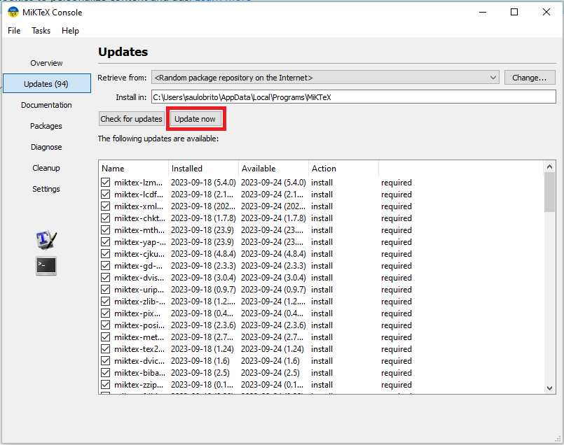

[](https://zenodo.org/doi/10.5281/zenodo.10078840) <a rel="license" href="http://creativecommons.org/licenses/by-nc/3.0/"></a><br />This work is licensed under a <a rel="license" href="http://creativecommons.org/licenses/by-nc/3.0/">Creative Commons Attribution-NonCommercial 3.0 Unported License</a>.


# CSV2RMD: um script em python para criar arquivos RMD de dicionário (html ou pdf) a partir de arquivo(s) csv.

Por favor use a referência seguinte para citar o programa em qualquer publicação que resulte de seu uso:

BRITO, Saulo; BIRCHALL, Joshua; GALÚCIO, Ana Vilacy. 2023. csv2rmd: Um programa python para produzir dicionário multimídia com Markdown. Versão 0.2-beta. Belém: Museu Paraense Emílio Goeldi. DOI: https://zenodo.org/doi/10.5281/zenodo.10078840.

## Introdução
A documentação de línguas é uma tarefa importante e desafiadora. É fundamental ter uma documentação precisa e abrangente das línguas para preservá-las e mantê-las vivas. Essa documentação muitas vezes envolve a coleta de dados linguísticos, que podem incluir palavras, frases, gramática e vocabulário, entre outros. Para documentar essas informações, é comum a utilização de diversos formatos, que podem ser práticos na manipulação, mas difíceis de serem organizados e formatados. A criação de dicionários e outros recursos linguísticos pode ser um processo demorado e complicado, especialmente para línguas menos conhecidas ou com poucos recursos disponíveis. É necessário apresentar essas informações de maneira estruturada e organizada, em um formato  em que possam ser facilmente compartilhadas e acessadas muitas vezes como ferramenta de manutenção do uso da língua.
A metodologia de elaboração de dicionários multimidia aqui apresentada surgiu em torno do uso do script "csv2rmd" que é uma ferramenta que gera arquivos "rmd" preenchidos
em formato Markdown a partir de tabelas com informações linguísticas
relacionadas a arquivos de mídia. Essa ferramenta é utilizada para criar
dicionários multimídia para línguas indígenas. O fluxo de trabalho
utilizado com o script "CSV2RMD.py" pode ser dividido em três etapas
distintas: a) preparação dos dados e metadados; b) uso do script; e c)
criação de produtos. Cada uma dessas etapas pode ser subdividida em
outras atividades como podemos observar na imagens a seguir. É importante destacar que as atividades
descritas não consideram os processos anteriores que envolvem a colecta
de material linguístico pelos pesquisadores.


Na preparação dos dados e metadados, é necessário organizar os arquivos
em pastas referentes ao tipo de mídia (foto, vídeo, áudio) com suas
respectivas nomenclaturas e preencher uma planilha CSV. Cada linha da
planilha se refere a uma entrada lexical no dicionário e inclui o nome
dos arquivos organizados nas pastas correspondentes. No uso do script, a
primeira etapa consiste em utilizar a opção "1 - Validar tabela
("dicionário.csv")". Essa opção busca linhas na tabela em que itens
essenciais para o funcionamento do script não estejam preenchidos
(validação de campos) e verifica problemas relacionados aos arquivos
(validação de arquivos). Todas as informações de validação, juntamente
com algumas totalizações, são exportadas no formato texto ("txt") para a
pasta de trabalho. Em seguida, é possível gerar os arquivos RMD de
acordo com a opção desejada (PDF,HTML ou HTMl Único), utilizando o
script. Por fim, para criar os produtos, devemos utilizar lingugem R por
meio de software como RStudio ou ainda com um script que faz parte do
processo descrito nesse manual.
Nesse manual você encontrará os pré-requisitos para rodar o script, instruções para utilização de scripts adicionais para tratamento das mídias, instruções de preeenchimento da tabela necessária para rodar o script, uma descrição das funcionalidades do script CSV2RMD em sí, instruções para transformar os arquivos html gerados em apk e ainda no capítulo 7 uma exemplo de uso, onde na prática utilizando os arquivos da nossa página no GITHUB mostramos como gerar um dicionário em formato html unico. Caso você deseje verificar como o processo do script funciona antes de se aprofundar nas funcionalidades você pode fazer a instalação dos pré-requisitos necessários e seguir as instuções do exemplo prático do capitulo 7 pra gerar um html funcional.

## Pré-requisitos

O script está disponível em dois formatos. Primeiramente, temos a versão
em Python, que foi o formato original no qual o script foi desenvolvido.
Essa versão pode ser executada em qualquer sistema operacional
compatível com a linguagem de programação Python, juntamente com as
bibliotecas necessárias. Além disso, oferecemos uma versão no formato
EXE, um executável compatível com o sistema operacional Windows. Essa
conversão foi realizada visando a facilidade de uso, permitindo aos
usuários executarem o script sem a necessidade de instalar o Python e
suas bibliotecas.

Para criar os produtos, você precisará instalar os seguintes requisitos:

-   [Linguagem R](https://cran.r-project.org/) (para a geração dearquivos HTML e PDF)
    -   Biblioteca bookdown do R (ver sessão instalar bookdown)
-   [MikTeX](https://miktex.org/download) (ver sessão sobre atualizar bibliotecas internas Miktex)

Caso queira executar a versão em python do script:

-   [Python 3](https://www.python.org/downloads/)
    -   Biblioteca Pandas instalada para Python

Caso você deseje personalizar os arquivos RMD gerados pelo script para
atender a necessidades específicas do seu projeto, recomendamos a
utilização do RStudio Desktop.

### Instalando bookdown

Depois de instalar o R, o programa com o mesmo nome "R" ficará
disponível em seu sistema operacional, geralmente junto ao nome há um
número de versão da linguagem por exemplo: "R 4.2.1". Será executando
esse programa que você terá disponível o console (destaque 1 em vermelho)
da linguagem R onde realizaremos a instalação do bookdonw:


Digitando o comando `install.packages("bookdown")` (destaque 1 em
vermelho na imagem abaixo) no console daremos início ao processo de
instalação do pacote, onde precisaremos escolher um dentre varios locais
para o donwload (destaque 1 em vermelho na imagem abaixo):


Depois de selecionar uma das opções de donwload o processo de instalação
será realizado e depois que a mensagem package
`‘bookdown’ successfully unpacked and MD5 sums checked` for exibida no
console o processo estará finalizado.

### Atualizar bibliotecas internas Miktex

Para gerar arquivos em formato PDF, é absolutamente essencial que o
programa MikTeX esteja atualizado, por isso sempre antes de iniciar o processo de produção dos produtos e necessário verificar se há novas atualizações, assim como suas bibliotecas internas.
Para garantir o funcionamento correto, é necessário abrir periodicamente
esses programas e buscar por atualizações disponíveis. Manter esses
programas atualizados assegurará a geração adequada de arquivos em
formato PDF e evitará possíveis problemas decorrentes de versões
desatualizadas. Para realizar esse procedimento primeiramente abra o
console do Miktex através da busca de aplicativos, ou caso o mesmo já
esteja iniciado em seu sistema você pode abri-lo através do ícone do
mesmo no canto inferior direito da barra de tarefas:


Na tela que aparecerá ao abrir o Miktex você deverá buscar a área de
Updates e clicar em 'Check for Updates', como no destaque em vermelho na
imagem a seguir:


Caso não hajam atualizações você pode fechar a janela e continuar o processo de produção de dicionários, caso contrário uma mensagem avisando de novas atualizações disponiveis aparecerá e vc poderá clicar no link em azul "updates page" para navegar ao menu de atualizações do miktex:


Na tela seguinte você poderá observar uma lista de todas as atualizações disponiveis e deverá clicar em "Update Now": 



Uma mensagem dizendo "Installing packages updates" será mostrada na parte inferir da lista de atualizações, vc deve aguardar enquanto as instalações  ão realizadas: 


Após a conclusão da instalação das bibliotecas uma mensagem pedindo para fechar o console será exibida: 


Após a execução desses passos as bibliotecas estarão atualizadas, você pode reiniciar o computador para garantir a instalação funcional dos novos recursos.


## Preparação das midias

Suas midias deverão estar separadas por pastas (audio, foto e video) os
formatos aceitos para imagens são jpeg/jpg ou png, para áudio o script
suporta tanto wav quanto mp3, mas devido a prolemas de tamanho
recomendamos o uso de mp3, para video o formato deve ser mp4. Junto ao
script csv2rmd você pode encontrar alguns scripts auxiliares que foram
criados para facilitar o processo de elaboração de dicionários no que se relaciona a preparação das mídias. São
esses:

-   DIMINUIR-BITRATE: diminuir o bitrate e consequentemente o tamanho de
    arquivos de audio com qualidade auta demais para fins de divulgação
-   PADRONIZAR-IMAGENS: ajustar imagens grandes demais para um tamanho
    padrão e separar imagens menores que o recomendado.
-   RECORTAR-AUDIO: recortar áudios de palavras a partir da transcrição
    em linhas especificas de arquivos EAF.

Você pode encontrar os arquivos na pasta "02-SCRIPTS-AUXILIARES".

### Script "RECORTAR-ÁUDIO"

O script "Recortar Áudio" é uma ferramenta desenvolvida para recortar
vários arquivos de áudio com base em referências de arquivos EAF (ELAN
Annotation Format). Ele permite a geração de recortes de áudio para
palavras e frases específicas, além de criar uma tabela no padrão
CSV2RMD. Para que o script "Recortar Áudio" funcione corretamente, é
necessário que as faixas de áudio do arquivo de anotação ELAN tenham os seguintes elementos em seus
nomes:

-   "\_Transcription-": Transcrição fonética.
-   "\_Translation--gls-pt": Tradução ou significado.
-   "\_Orthography-": Item lexical e exemplos.
-   "CSV2RMD": Anotações de nome e referências de exemplos.

Na trilha "CSV2RMD" deve-se fazer anotações apenas nos trechos que
precisam ser exportados. Os nomes inseridos nesses trechos serão usados
nos nomes dos arquivos e na tabela que será gerada. O nome final do
arquivo exportado incluirá o nome do arquivo de áudio/EAF e o nome
definido na trilha CSV2RMD. Por exemplo, se o nome do arquivo de áudio
for "SKF-20190125-AVG-RB-manufatura" e o nome definido na trilha CSV2RMD
for "cesto", o arquivo exportado será nomeado como
"SKF-20190125-AVG-RB-manufatura-cesto".

Para definir um exemplo para uma palavra, basta adicionar o sufixo
"-ex". Por exemplo, se desejar definir uma frase da transcrição como
exemplo para a palavra "cesto", você pode adicionar "cesto-ex" na trilha
CSV2RMD. Se desejar usar uma mesma frase como exemplo para várias
palavras, pode-se utilizar o separador de barra vertical (\|) para
indicar isso. Por exemplo, na trilha CSV2RMD, no trecho da frase
correspondente, você pode ter "cesto-ex\|casa-ex".

Essas relações entre palavras (trechos sem "-ex") e exemplos (trechos
com "-ex") são essenciais para que o script construa uma tabela chamada
"dicionario.csv" com os dados provenientes das trilhas dos arquivos
recortados. Isso facilita o processo de preenchimento da tabela e a
produção de dicionários em geral.

Pré-requisitos (somente python): Certifique-se de que o FFMpeg está na
pasta "ffmpeg" do mesmo diretório onde o script está localizado. Isso é
necessário para manipular arquivos de áudio. - Certifique-se de que você
possui o Python instalado em seu sistema. - Instale as bibliotecas
necessárias executando o comando a seguir:

```         
bash
pip install pydub pympi-ling pandas tqdm
```

Instruções de Uso

1.  Coloque os arquivos de áudio no formato WAV ou MP3 na mesma pasta
    que o script.

2.  Coloque os arquivos Elan (EAF) com nomes iguais aos arquivos de áudio correspondentes na mesma pasta que o script.

3.  Execute o script Python em seu terminal ou ambiente Python.

    bash python seu_script.py

4.  O script perguntará em qual formato você deseja exportar os recortes
    de áudio, com as seguintes opções:

    -   Digite `1` para WAV.
    -   Digite `2` para MP3.

5.  O script processará os arquivos EAF e associará as transcrições aos
    respectivos trechos de áudio.

6.  Os recortes de áudio serão exportados para a pasta "audio" no
    formato escolhido.

7.  O script gerará um arquivo CSV chamado "dicionario.csv" na pasta
    "audio" com as informações organizadas.

8.  Após a conclusão, o script oferecerá a opção de digitar 's' para
    sair.

Importante - Verifique se os arquivos de áudio e EAF têm nomes
correspondentes para que o script possa associá-los corretamente.

### Script "DIMINUIR-BITRATE"

Pré-Requisitos (Versão Python):

1.  Certifique-se de que o FFmpeg está na pasta "ffmpeg" do mesmo
    diretório onde o script está localizado. Isso é necessário para a
    manipulação de arquivos de áudio.

2.  Certifique-se de que você possui o Python instalado em seu sistema.

3.  Instale as bibliotecas necessárias executando o seguinte comando no
    terminal:

    ``` bash
    pip install pydub
    ```

Instruções de Uso:

Instruções de 1-3 apenas python

1.  Coloque os arquivos de áudio que deseja converter na pasta "audio"
    no mesmo diretório onde o script Python está localizado. Os formatos
    suportados são .wav, .mp3 e .ogg.

2.  Abra um terminal ou prompt de comando.

3.  Navegue até o diretório onde o script Python está localizado.

4.  Execute o script em exe ou caso use a versão python execute o script
    com o seguinte comando:

    ``` bash
    python diminuir-bitrate.py
    ```

5.  O script solicitará que você insira o bitrate desejado para a
    conversão dos arquivos de áudio. Digite o valor desejado em kbps
    (por exemplo, "128" para 128 kbps).

6.  O script processará os arquivos de áudio e os converterá para o
    bitrate especificado.

7.  Os arquivos convertidos serão armazenados na pasta "convertidos"
    dentro da pasta "audio".

8.  Durante a conversão, você verá mensagens indicando o progresso da
    conversão e quais arquivos foram convertidos com sucesso.

9.  Após a conclusão, o script informará que a tarefa foi concluída e
    aguardará sua entrada.

10. Digite 's' e pressione Enter para sair do script.

Observações: - Certifique-se de que todos os arquivos de áudio que
deseja converter estejam na pasta "audio" antes de iniciar o script. -
Se algum arquivo não puder ser convertido, você receberá uma mensagem
informando que o arquivo não pode ser convertido.

### Script "PADRONIZAR-IMAGENS"

Pré-Requisitos (para versão python):

1.  Certifique-se de que você tenha a pasta do `ffmpeg` no mesmo
    diretório onde o script está localizado.

2.  Certifique-se de que você tenha o Python 3 instalado em seu sistema.

3.  Instale as bibliotecas necessárias executando o seguinte comando no
    terminal ou prompt de comando:

    ``` bash
    pip install pillow
    ```

Instruções de Uso:

1.  Coloque as imagens que deseja processar na pasta "foto" no mesmo
    diretório onde o script está localizado. Os formatos suportados são
    .jpeg, .jpg e .png.

2.  Execute o script em exe ou caso use a versão em python no terminal
    ou prompt de comando com o seguinte comando (o cmd precisa estar
    rodando na pasta do script):

    ``` bash
    python padronizar-imagens.py
    ```

3.  O script processará as imagens da pasta "foto" e realizará as
    seguintes ações:

    -   Redimensionará as imagens de acordo com os parâmetros
        especificados.
    -   Moverá as imagens processadas para a pasta "revisadas".
    -   Moverá as imagens muito pequenas para a pasta "pequenas".
    -   Excluirá a pasta "modificadas" e seu conteúdo após o
        processamento.

4.  Durante o processamento, você verá informações sobre o tipo de
    imagem (paisagem, retrato ou quadrada) e suas dimensões antes e
    depois da conversão.

5.  Após a conclusão do processamento, o script informará que a tarefa
    foi concluída e aguardará sua entrada.

6.  Digite 's' e pressione Enter para sair do script.

Observações:

-   Certifique-se de que todas as imagens que deseja processar estejam
    na pasta "foto" antes de iniciar o script.
-   Se alguma imagem não puder ser processada de acordo com os critérios
    definidos, ela será movida para a pasta "pequenas".

## O arquivo "dicionario.csv"

O arquivo "dicionario.csv" nada mais é que um documento de texto com
valores separados por vírgula (CSV) que pode ser aberto e alimentado em
qualquer editor de planilhas comumente usado em computadores (Para
evitar a necessidade de conversão ao abrir a planilha recomendamos a
utilização de LibreOficce). Nesses arquivos as entradas são inseridas
por linha, e cada linha representa uma entrada na língua com um de seus
possíveis significados. Alguns campos utilizados na planilha são
obrigatórios para o funcionamento correto do script:

-   Item Lexical: O termo principal ou a palavra específica incluída no
    dicionário.

-   Tradução ou Significado: A tradução ou o significado do item lexical
    em outro idioma, fornecendo uma equivalência. Recomenda-se iniciar
    com letra minúscula.

-Campo Semântico: A área temática ou a categoria ampla à qual o item
lexical está relacionado. Descreve o contexto ou o domínio em que a
palavra é utilizada e ajuda a agrupar termos similares.
 
Os outros campos são opcionais:

-   Arquivo Sonoro: Nome do arquivo de áudio associado ao item lexical
    exatamente como na pasta de mídias.
-   Classe Gramatical: A categoria ou classificação gramatical à qual o
    item lexical pertence. Inclui categorias como verbos, substantivos,
    adjetivos, pronomes, entre outros. A classe gramatical pode variar
    dependendo do idioma e das convenções específicas. É comum usar
    abreviações para indicar a classe gramatical, como "v" para verbo,
    "s" para substantivo, "adj" para adjetivo, etc.
-   Transcrição Fonêmica: Uma representação fonêmica da pronúncia do
    item lexical usando símbolos fonêmicos. Diferente da transcrição
    fonética, a transcrição fonêmica representa os sons distintivos de
    um determinado sistema fonológico, ignorando variações fonéticas
    específicas.
-   Transcrição Fonética: Uma representação fonética mais detalhada da
    pronúncia do item lexical. Diferente da transcrição fonêmica, a
    transcrição fonética considera as variações específicas dos sons,
    incluindo nuances fonéticas e alofones
-   Descrição: Uma explicação ou definição mais detalhada do item
    lexical. Pode incluir informações adicionais sobre o significado, o
    uso ou outros aspectos relevantes da palavra ou da expressão.
    Recomenda-se iniciar com letra maiúscula.
-   Arquivo de Imagem: Nome do arquivo de imagem associado ao item
    lexical, exatamente como na pasta de mídias. Pode ser uma
    ilustração, uma fotografia ou um recurso visual que complementa a
    entrada do dicionário.
-   Subcampo Semântico: Uma subdivisão ou categoria mais específica
    dentro do campo semântico. Proporciona uma classificação adicional
    ou uma descrição mais detalhada do contexto ou domínio do item
    lexical.
-   Arquivo Sonoro de Exemplo: Nome do arquivo de áudio que contém um
    exemplo, exatamente como na pasta de mídias.
-   Arquivo de Vídeo: Nome do arquivo de vídeo que contém um exemplo,
    exatamente como na pasta de mídias.
-   Transcrição do Exemplo: A transcrição de um exemplo relacionado ao
    item lexical, utilizando o sistema ortográfico da língua em questão.
-   Tradução do Exemplo: Uma tradução da transcrição do exemplo em outro
    idioma que é fornecida como exemplo relacionado ao item lexical.

É recomendado que se adicionados os arquivos de som as respectivas
traduções e transcrições sejam adicionadas.

### Casos especiais de preenchimento da tabela

#### Multiplos exemplos

Com o intuito de esclarecer o uso de múltiplos exemplos em nosso modelo
de dicionário, é essencial compreender quais campos da tabela estão
diretamente associados a esses exemplos. Esses campos específicos são:
TRANSCRIÇÃO DO EXEMPLO, TRADUÇÃO DO EXEMPLO, ARQUIVO SONORO DO EXEMPLO e
ARQUIVO DE VÍDEO.

Para que possamos incorporar mais de um exemplo nesses campos, é
necessário utilizar um caractere especial, a barra vertical ("\|"). Ao
empregar esse separador, é possível incluir dois elementos do mesmo tipo
em uma única célula. O script perceberá que existe mais de um elemento
do mesmo tipo na mesma célula, desde que haja a barra vertical como
indicador.

Entretanto, é importante salientar que, para que o script funcione
corretamente, todos os elementos de uma mesma linha relacionados a um
exemplo precisam conter a mesma quantidade de barras verticais. Por
exemplo, se existirem dois exemplos, será necessário que na mesma linha
tenhamos: "Arquivo som exemplo 1\|, Transcrição 1\| Transcrição 2,
Tradução 1 \| Tradução 2" e assim sucessivamente. Perceba que mesmo que o segundo
exemplo não possua um arquivo de áudio, ainda é necessário que a célula do arquivo de som na planilha
contenha uma barra vertical para indicar que o arquivo ali descrito
pertence ao primeiro exemplo (lado esquerdo da barra) e não ao segundo
(lado direito).

Mediante o uso sistemático das barras verticais e ao respeitar a
disposição e correspondência adequada dos itens em relação a essas
barras, é viável adicionar quantos exemplos forem necessários para cada
entrada no dicionário.

#### Variações lexicais

Com o objetivo de esclarecer como usar barras verticais para criar
variantes em nosso dicionário, é crucial compreender quais itens da
tabela estão diretamente ligados a essas variações. Os campos
específicos relacionados a variações lexicais são os itens diretamente ligados ao item lexical em si, são estes: ITEM LEXICAL, TRANSCRIÇÃO
FONÊMICA, TRANSCRIÇÃO FONÉTICA e ARQUIVO SONORO.

A fim de incorporar múltiplas variantes nesses campos, é necessário
empregar o caractere especial da barra vertical ("\|"). Ao utilizar esse
separador, é possível incluir diferentes variantes de um mesmo item em
uma única célula da tabela. O script reconhecerá que há mais de uma
variante na mesma célula, desde que haja uma barra vertical como
indicativo.

Todavia, é relevante destacar que para que o script funcione de maneira
adequada, todos os elementos em uma mesma linha, relacionados a uma
variante, precisam ter a mesma quantidade de barras verticais. Por
exemplo, se existem duas variantes para um determinado item, é
necessário que na mesma linha tenhamos: "Item Lexical 1\| Item Lexical
2, Transcrição Fonêmica 1\| Transcrição Fonêmica 2, Transcrição Fonética
1 \| Transcrição Fonética 2" e assim por diante.

Mesmo que a segunda variante não possua um arquivo sonoro associado,
ainda assim é necessário que ela contenha uma barra vertical para
indicar que o arquivo mencionado pertence à primeira variante (lado
esquerdo da barra) e não à segunda variante (lado direito).

Ao seguir uma abordagem consistente com o uso das barras verticais e ao
manter a organização correta dos elementos em relação a essas barras, é
possível adicionar diversas variantes a cada entrada no dicionário,
ampliando a riqueza de informações disponíveis.

#### Multiplos significados

Devido à organização atual do dicionário baseada em campos semânticos, é
raro nos depararmos com palavras que possuam múltiplos significados. No
entanto, em situações específicas, pode ser necessário lidar com essa
funcionalidade. Para incorporar esse sistema de ordenação, faremos uso
de mais de uma linha na tabela. Cada linha conterá os mesmos elementos
referentes à própria palavra, enquanto os significados e exemplos variam
conforme a necessidade.

Para que duas palavras sejam associadas à mesma entrada, é crucial que
ambas compartilhem esses campos de formaidêntica: o item lexical, a
classe gramatical, o campo semântico e o subcampo semântico. Quando
esses elementos se repetirem entre duas ou mais entradas do dicionário, essas
linhas serão unificadas em uma única entrada, com os significados
numerados de forma distintiva.

## O script CSV2RMD

O fluxo de trabalho relacionado especificamente com a execução do script CSV2RMD geralmente envolve duas etapas:
Validar a tabela e Gerar um produto, então provavelmente você precisará
executar o script pelo menos duas vezes, uma primeira para verificar
possíveis problemas com a tabela em relação a mídias e campos
obrigatórios e uma segunda vez utilizando umas das outras opções disponíveis para
gerar os arquivos rmd (2-4). Da forma mais básica possível para
obter uma versão do dicionário, você precisará realizar o seguinte:

1.  Preparar os Arquivos Necessários: Certifique-se de ter uma pasta
    contendo todos os arquivos necessários. Isso inclui o arquivo CSV, o
    Script em python ou exe,outros possíveis recursos como áudios,
    imagens ou videos separados por pastas (nome padrão das pastas de
    mídia: audio, video e foto).

2.  Executar o Script: Execute o script, seja o arquivo ".py" ou o
    ".exe", de acordo com a sua escolha. Isso iniciará a interface do
    script.

3.  Selecionar a opção "Validar Tabela ('dicionario.csv')": gerar
    arquivos de validação na pasta do arquivo csv para garantir que não
    a pendêcias a serem resolvidas, um arquivo chamado
    "pendencias-arquivos.txt" sempre será gerado um arquivo
    "pendencias-campos.txt" pode ou não ser gerado dependendo da
    existencia dessas pêndencias (você pode minimizar o script para
    verificar os arquivos ou apenas fechar o mesmo e reiniciar depois).

4.  Rodar o script e selecionar quais tipo de produto e o selecionado:
    Selecionar entre gerar "Gerar arquivod RMD para criar PDF", "Gerar
    arquivo RMD para criar HTM" ou "Gerar arquivos RMD para criar HTML
    único".

5.  Selecionar a Opção "Gerar os RMDS com Opções Padrão": Dentro da
    interface do script, escolha a opção que permite gerar os RMDS com
    as configurações padrão. Isso iniciará o processo de conversão dos
    dados do CSV para arquivos RMD.

6.  Definir Título e Autor: Durante o processo de geração dos RMDS, você
    será solicitado a fornecer um título e o nome do autor. Preencha
    essas informações de acordo com as suas preferências.

7.  Abrir a Pasta Gerada: Após a conclusão do processo, a pasta contendo
    os arquivos RMD gerados estará disponível. Abra essa pasta para
    visualizar os resultados.

8.  Utilizar o Script "GERAR-PRODUTOS.exe": Execute o script chamado
    "GERAR-PRODUTOS.exe". Este script adicional é responsável por gerar
    os produtos finais a partir dos arquivos RMD gerados. Certifique-se
    de seguir as instruções fornecidas para concluir este passo.

9.  Abrir o Produto Gerado: Uma vez concluído o processo de geração de
    produtos, você encontrará o resultado final. Abra o produto gerado
    para visualizar o dicionário no formato desejado (HTML, PDF, ou
    outro)


### Opções principais

#### 1 - Validar tabela ("dicionario.csv")

Ao selecionar essa opção serão criados arquivos de texto que trarão as
pendências nos campos essenciais necessários para executar o script,
incluindo o campo ITEM_LEXICAL, TRADUCAO_SIGNIFICADO, CAMPO_SEMANTICO,
bem como possíveis equívocos relacionados à utilização da barra "\|"
para múltiplos exemplos ou variantes. Adicionalmente, será gerado um
segundo arquivo de texto para registrar pendências relativas aos
arquivos, abordando situações onde os arquivos referenciados na tabela
não estejam presentes na pasta correspondente ou onde arquivos presentes
na pasta não estejam referenciados na tabela. Este arquivo de pendências
em relação aos arquivos sempre será geradopela além das pendências ele
conterá informações gerais sobre o dicionário que está sendo produzido.

#### 2 - Gerar arquivos RMD para criar PDF

Elabora os arquivos RMD de um projeto Bookdown indispensáveis para a
produção de um dicionário em formato PDF. Após a utilização dos arquivos
para gerar o produto, será possível localizar o arquivo em PDF e um
arquivo editável em formato "tex" na pasta "book", no mesmo diretorio.

#### 3 - Gerar arquivos RMD para criar HTML

Produz os RMDs separados por campos semânticos visando a construção de
um site em formato HTML. Para realizar a geração dos produtos utilizando
essa opção, é imprescindível copiar as pastas de mídia para o interior
da pasta "html", a fim de que essas sejam incorporadas à pasta "site"
onde o produto final será gerado..

#### 4 - Gerar arquivos RMD para criar HTML único

Elabora um arquivo RMD único, internamente segmentado por campos
semânticos, com a finalidade de gerar um arquivo HTML contendo mídias
incorporadas. Como resultado desse processo, será criado um arquivo
denominado "dicionario.html" na mesma pasta onde os arquivos RMD estão
localizados.

É importante validar a tabela e corrigir possíveis falhas antes de gerar
arquivos RMD. As opções de gerar HTML ou PDF irão gerar pastas com os
arquivos necessários para criar os produtos finais utilizando a
linguagem R e Miktex/Mactex no caso de criação de arquivos PDF.

### Opções de customização do dicionário

#### Arquivos de texto para configuração

Os próximos subitens tratam de arquivos de texto relacionados ao
processo de elaboração de dicionários. Quando esses arquivos estão
localizados na mesma pasta do script, eles são utilizados para
configurações específicas, desempenhando um papel fundamental no ajuste
do funcionamento do programa.

##### Adicionando uma introdução

Uma maneira simplificada de introduzir uma seção de introdução em um
documento criado com o uso do csv2rmd é fornecer a capacidade de
adicionar um texto introdutório diretamente no início do arquivo de
entrada, evitando a necessidade de recorrer a editores de texto
adicionais. Para realizar essa tarefa, os seguintes passos podem ser
seguidos:

1.  Crie um arquivo de texto chamado "intro.txt".

2.  No arquivo "intro.txt", insira o conteúdo que você deseja incluir na
    seção de introdução do documento. Você pode utilizar a linguagem de
    marcação Markdown para formatar o texto de acordo com suas
    preferências. Por exemplo:

```         
      # Introdução
      
      Este é um documento que descreve os aspectos importantes
      de nosso projeto. Aqui, discutiremos as etapas envolvidas,
      os objetivos a serem alcançados e as considerações-chave a 
      serem feitas.
      
      Além disso, você pode adicionar formatação ao texto, como 
      **negrito**, _itálico_, listas e até mesmo imagens:
      
      
      
      Continue lendo para saber mais sobre nosso projeto 
      emocionante!
```

3.  Ao rodar o script, se um arquivo de introdução for encontrado na
    pasta, o seu conteúdo será automaticamente inserido na seção
    reservada para a introdução nos arquivos RMD gerados. Entretanto, se
    tal arquivo não for localizado, um texto indicativo "SUA INTRODUÇÃO
    VAI AQUI" será inserido nesse ponto específico, funcionando como um
    marcador para onde a introdução deve ser adicionada.

##### Definindo uma ordem alfabética

Muitas vezes, torna-se necessário adotar uma ordem alfabética específica
ao criar dicionários de línguas indígenas. Se você precisa organizar os
dicionários de acordo com uma ordem específica, pode utilizar um arquivo
de texto (txt) na pasta principal do script para ativar essa
funcionalidade. Para implementar isso, siga as seguintes etapas:

1.  Crie um arquivo de texto com o nome "ordem-alfabeto.txt".

2.  Dentro deste arquivo, liste todos os caracteres que são utilizados
    nos itens lexicais do dicionário, organizados conforme a ordem
    alfabética desejada. Separe esses caracteres por vírgulas. Aqui está
    um exemplo dessa estrutura: a, b, e, g, i, k, kw, m, n, ng, ngw, o,
    p, r, s, t, u, w, y, '

Certifique-se de incluir todos os caracteres relevantes que serão usados
no dicionário. Uma vez que esse arquivo esteja preparado, o script
utilizará essa ordem alfabética específica para organizar os itens
lexicais no dicionário.

Lembrando que, ao adotar essa abordagem, você terá um maior controle
sobre a ordem de apresentação das palavras e termos no dicionário, de
acordo com as particularidades da língua indígena em questão

##### Arquivo de configuração

Em muitas ocasiões, durante a produção de um dicionário, é necessário
executar o script mais de uma vez. Isso pode acontecer devido a
revisões, ajustes específicos ou necessidades particulares. Para
simplificar o fluxo de trabalho, o script é capaz de armazenar as
respostas dos usuários em um arquivo chamado "configuracao.txt".

Vejamos um exemplo de como o conteúdo do arquivo de configuração pode
parecer:

```         
Título=Dicionário Teste
Autor(es)=teste
Opção de legenda automática para áudio=1
Manter a ordem alfabética=2
Alterar ordem Alfabética em todo arquivo=2
Não usar ordem alfabética=Animais,Plantas
Alterar ordem dos campos=2
Ordem dos campos=1,0
```

Observe que cada pergunta feita pelo script possui uma chave única que é
apresentada antes do sinal de igualdade no arquivo. Essas chaves são
usadas pelo script para identificar se uma resposta foi fornecida
anteriormente. Se já houver uma resposta correspondente a essa chave, o
script a utiliza, reduzindo a necessidade de repetir os processos mais
complexos de personalização.

Essa abordagem simplifica o processo, economiza tempo e evita a
redundância. Caso deseje recomeçar todo o processo de personalização,
basta apagar o arquivo de configuração ou editá-lo com novas respostas.
Essa flexibilida.de permite ajustar o dicionário de acordo com suas
necessidades em diferentes momentos do processo de criação

#### Opções de customização do Menu

A seguir, discutiremos as opções de personalização disponíveis ao gerar
documentos RMDs utilizando o script. Essas opções substituem a abordagem
simples que solicita apenas o título e o autor do documento. Para
selecionar qualquer opção de customização ao gerar os produtos você deve
selecionar a opção de `Customizar RMD's` ao invés de
`Gerar RMD's com opções padrao`.

##### Mantendo a ordem utilizada da tabela

Quando necessário, é possível preservar a ordem de organização dos itens
conforme estabelecida na planilha. Essa opção mantém a estrutura,
separando os itens em campos e subcampos, seguindo o padrão de
organização original.

Para começar, você deve escolher entre duas opções: "Manter a ordem
original de todo o arquivo 'dicionario.csv'" ou "Manter a ordem original
em categoria(s) específica(s)".

Caso opte por manter a ordem utilizada na planilha somente em categorias
específicas, você terá a oportunidade de selecionar quais categorias
deseja preservar. Nesse menu adicional, você deve separar os nomes das
categorias por vírgula, por exemplo: Animais, Plantas, Manufaturas. É
importante destacar que, ao escolher a segunda opção, você deve
especificar quais categorias deseja que mantenham a ordem da planilha;
as categorias não mencionadas serão organizadas pelo script de forma
padrão.

##### Ordem dos campos Semânticos

O script oferecerá a opção de personalizar a ordem dos campos semânticos
utilizados no dicionário. Inicialmente, ele exibirá a ordem atual dos
campos, que será algo como: "A ordem atual dos campos é: 0 - Animais,
1 - Plantas, 2 - Manufaturas". A partir daí, você terá que escolher
entre "Não alterar ordem" ou "Sim, alterar a ordem".

Caso opte por alterar a ordem, o script solicitará que você especifique
a nova ordem utilizando os números associados a cada campo semântico,
separados por vírgula e organizados conforme sua preferência. Por
exemplo: "2,1,0". Isso permitirá que você estabeleça a disposição
desejada para os campos semânticos.

##### Opção de informação de autor e data aos arquivos de áudio e vídeo no html

Ao utilizar a opção de `Gerar arquivos RMD para criar HTML` e
`Gerar arquivos RMD para criar HTML único` com a opção de customizar
você terá a opção de adicionar as informações de autor e data para os
arquivos de áudio e vídeo no entanto para utilizar essa versão é
necessário que os arquivos estejam com a nomenclatura padrão do Museu
Goeldi:

<p align="center">

COD-AAAAMMDD-PES-FAL-FAL-sessao-num

</p>

-   COD: Código da língua (três dígitos)
-   AAAAMMDD: data no formato ano, mês e dia(exemplo: 20220517)
-   PES: Sigla para o pesquisador (Maiúsculo)
-   FAL: Sigla para os falantes da sessão (Maiúsculo)
-   sessao: Um título para o arquivo ou um conjuntos de arquivos
-   num: uma numeração opcional para distinguir arquivos do mesmo
    formato que façam parte da mesma sessão.

Além da nomenclatura é necessário o uso de um arquivo CSV contendo as
informações de autor e sigla dos falantes que você deseja que apareçam
no documento como a seguir:

| codigo | ator            |
|--------|-----------------|
| JB     | Joshua Birchall |

No entanto, caso haja itens lexicais que apresentem esses mesmos
elementos, mas você não deseje que eles se combinem em uma única
entrada, é possível usar o símbolo de porcentagem (%) antes do item
lexical correspondente, ou seja, exatamente no campo ITEM_LEXICAL da
tabela deve ser adicionado antes da palavra o símbolo de porcentagem.
Essa ação assegurará que essas linhas não sejam agrupadas.

## Transformando um html em apk com HTML2APK

Após ter gerado o seu HTML utilizando as ferramentas destacadas neste
manual, você terá a possibilidade de criar um APK de teste. Esse APK
representa uma versão de debug, não obtida através da Google Play Store,
mas funcional o suficiente para ser compartilhada e utilizada em
dispositivos Android, simplificando a experiência nesses aparelhos.

Para executar esse processo, siga os passos abaixo, que utilizam o
Google Drive e um script online na plataforma Google Colab:

-   Crie uma pasta denominada "dicionario".
-   Dentro dessa pasta, adicione o seu arquivo HTML.(Se o seu HTML
    gerado não for um "html único" incluir mídias que estão em pastas
    separadas, certifique-se de incluir essas pastas relacionadas)
-   Adicione uma imagem no formato PNG com o nome "icone.png". Essa
    imagem será utilizada como o ícone do APK. \*Faça o upload da pasta
    "dicionario" para a pasta principal do seu Google Drive.
-   Acesse: [HTL2APK](https://colab.research.google.com/drive/1cUzSHVnjYazNSGJ6qx5wQWdShVQyztQI?usp=sharing)

Na página inicial, você encontrará instruções básicas sobre como
utilizar o script. Após ter concluído todos os passos anteriores, estará
pronto para iniciar a utilização do script. Nesse momento, clique no
botão de reprodução (play) na página onde o script está localizado.


Ao executar o script uma janela de autorização será exibida, solicitando
acesso à sua conta do Google Drive. Essa autorização é necessária para
permitir a cópia da pasta "dicionario" para o ambiente onde o script
está sendo executado, na janela você deve selecionar "Conectar ao Google
Drive" e seguir os passos de login e fornecer as permissões necessárias:


Se a cópia for bem sucedida, será solicitado um nome para sua aplicação:


Uma série de comandos será iniciada e importante que você acompanhe o
andamente desses commandos por que será solicitada autorização para que
umas das bilbiotecas utilizadas no script rode em modo administrador
você deverá responder com "y":


A partir desse comando o script demorara em torno de 40 minutos para
empacotar sua aplicação no formato apk, após a execução se tudo ocoreu
corretamente você receberá a mensagem "\# Android packaging done!":


Para encontrar o apk gerado pelo script você deverá abrir o sistema de
arquivos do ambiente de execução do script e encontrando e abrindo a
pasta bin, e então você poderá baixar o aplicativo utilizando o botão
esquerdo do mouse sobre ele e acionando a opção "Fazer download":


Lembre-se de que este processo permitirá que você crie um APK de teste
funcional, ideal para compartilhar e testar a sua aplicação em
dispositivos Android. Esteja ciente de que esse APK não é baixado da
Google Play Store e, portanto, é destinado apenas para fins de teste e
compartilhamento entre usuários autorizados.

## Exemplo prático

Após garantir que todos os pré-requisitos para a execução do script
foram atendidos, caso esta seja a sua primeira vez utilizando o script,
é recomendável que você utilize os arquivos fornecidos juntamente com
ele como exemplos. Isso permitirá que você crie o seu primeiro
dicionário utilizando o CSV2RMD. Para fazer isso, siga os passos e
orientações detalhadas nesta seção.

### Os arquivos necessários

Dentro da pasta do script "01-CSV2RMD", você terá acesso aos seguintes
arquivos:

-   Pasta "audio": Esta pasta contém os arquivos de áudio que são
    referenciados na planilha do dicionário.

-   Pasta "foto": Aqui estão armazenados os arquivos de imagem
    referenciados na planilha do dicionário.

-   Pasta "video": Esta pasta contém os arquivos de vídeo referenciados
    na planilha do dicionário.

-   CSV2RMD.exe: Um script executável que pode ser usado diretamente no
    sistema operacional Windows.

-   CSV2RMD.py: O script original em formato Python, editável e
    compatível com qualquer sistema que suporte a linguagem de
    programação Python.

-   dicionario.csv: Uma planilha contendo informações relacionadas às
    entradas lexicais do dicionário.

Para criar um dicionário básico utilizando o CSV2RMD, disponibilizamos
para download uma planilha de exemplo, chamada 'dicionario.csv',
juntamente com a pasta que contém o script. A mencionada planilha de
exemplo está localizada na pasta '01-CSV2RMD' e engloba informações
sobre 20 termos lexicais em inglês, sendo esses termos associados a dois
campos semânticos distintos: "Animais" e "Plantas". Cada termo lexical
presente na planilha é acompanhado por informações básicas que
constituem uma entrada de dicionário. Essas informações, que são
utilizadas nos dicionários gerados por meio do script, abrangem diversos
aspectos de cada entrada. Ademais, cada linha na planilha contém os
nomes de arquivo referentes às imagens e áudios relacionados a essas
entradas. Esses arquivos são armazenados nas respectivas pastas de mídia
localizadas no diretório principal do script.

### Rodando o script

Os scripts que estão disponíveis para download e relacionados à produção
de dicionários estão organizados em suas respectivas pastas nos formatos
".py" e ".exe". Os arquivos no formato ".exe" permitem a execução do
script sem a necessidade de instalar o Python. Se você preferir utilizar
a versão em Python, siga as instruções fornecidas na seção 'Executando o
Script em Python'. Por outro lado, se optar pelo arquivo .exe, basta
clicar duas vezes no arquivo ou pressionar o botão 'Enter' após
selecionar o script.

O "CSV2RMD" é um script de conversão projetado para transformar uma
planilha no formato CSV em documentos no formato RMD, que podem ser
posteriormente convertidos para formatos específicos. Para fazer isso,
você precisará usar pelo menos duas das opções disponíveis no script. O
processo começa pela revisão da planilha e, uma vez que quaisquer erros
tenham sido corrigidos, você poderá gerar os documentos RMD para o
produto final desejado. Então ao executar o script primeiramente
selecionaremos a opção **`1 - Validar tabela ("dicionario.csv")`** (Para
mais detalhes verifique: Opções disponíveis no script):


No cenário em que a planilha de exemplos esteja isenta de erros, apenas
o arquivo "pendencias-arquivos.txt" será gerado. Esse arquivo conterá
informações fundamentais sobre os dados contidos na planilha. Com o
objetivo de simplificar a criação do dicionário, você pode fazer uso do
arquivo "intro.txt" para inserir uma introdução no seu documento. Dessa
forma, torna-se dispensável o uso de um editor posterior para essa
finalidade. É relevante observar que qualquer texto incluído no arquivo
de introdução pode ser formatado utilizando a linguagem Markdown,
permitindo a ênfase em informações relevantes no texto.


Para gerar os arquivos RMD para um html único você deve utilizar a opção
**`4 - Gerar arquivos RMD para criar HTML único`**, selecionar a opção
de **`Gerar os RMDS com opções padrão`** e responder as questões
referentes a título e autoria e o script irá gerar uma pasta com os
arquivos convertidos para rmd e demais arquivos necessários para criar
um dicionário funcional.

![Pasta "html_unico" gerada pelo script]

### Gerando os produtos de forma simplificada

Se o script foi executado com sucesso e você está usando a estrutura de
pastas original que foi baixada da página do script, a pasta gerada
chamada "html_unico" conterá um arquivo com o nome "GERAR-PRODUTOS.exe".
Se por algum motivo esse arquivo não estiver na pasta mencionada, você
pode encontrá-lo na pasta "02-Scripts-auxiliares". Ao executar esse
arquivo, você poderá gerar o produto final de forma automatizada. O
arquivo "GERAR-PRODUTOS.exe" utiliza a linguagem R para transformar os
arquivos presentes na pasta em um produto final. Ao executá-lo, ele
combina os arquivos RMD, os arquivos de configuração e as mídias
correspondentes na pasta principal. O resultado desse processo é o
arquivo "dicionário.html". Uma vez que o processo de geração do
dicionário é concluído, você pode abrir o arquivo HTML gerado em
qualquer navegador. Além disso, você pode também abrir o arquivo
"dicionario.csv" para observar como cada elemento da planilha se
apresenta no produto final, o que possibilita a visualização das
informações de maneira completa e interativa. Após a primeira utilização
do script, um arquivo de texto chamado "configuracao.txt" será
automaticamente gerado. Esse arquivo é designado para armazenar as
respostas fornecidas por você, o que possibilitará o uso futuro sem a
necessidade de reiterar essas respostas ao gerar novas versões do
dicionário. Se desejar, é viável modificar as respostas armazenadas
nesse arquivo ou, alternativamente, eliminar o arquivo em si, o que
resultará na reapresentação das questões durante a próxima execução do
script. Essa funcionalidade tem como propósito primordial simplificar o
uso das opções de personalização, que serão abordadas mais adiante neste
documento.


## Executando o script em python

Use essa sessão somente se você for utilizar o script em formato python.
Para executar um script em python, além dos pré requisitos já citados
anteriormente, você precisará utilizar um Terminal ou Prompt de Comando
e seguir estes passos:

Após cada comando será necessario apertar a tecla "Enter" para que o
mesmo seja executado.

1 - Navegue até a pasta do script: Se o script não estiver na pasta
padrão do terminal, navegue até a pasta onde o script está localizado
usando o comando cd (Change Directory). Por exemplo: "cd
caminho/para/CSV2RMD-Files/01-CSV2RMD"


Ao utilizar o comando cd junto do caminho da pasta do script (1
destacado em vermelho) o indicador da pasta mude de "C:\\Users\\tiago\>"
para "C:\\CSV2RMD-Files\\01-CSV2RMD\>" (2 destacado em vermelho)
indicando que agora executaremos comandos dentro da pasta para qual
navegamos.

2 - Rode o script utilizando o comando "python": uma vez na pasta onde o
arquivo ".py" está localizado podemos simplesmente executar o comandon
"python" acrescido do nome do arquivo python da pasta que desejamos
executar,então para executar o script utilizariamos: python CSV2RMD.py.


Na imagem acima podemos verificar que ao executar o comando 'python
CSV2RMD.py' (destaque em vermelho) o script já executa e dispõe suas
opções.

## Gerando os produtos no RStudio

Antes de gerar os produtos no Rstudio e necessário conhecer o programa,
em essencial podemos destacar as partes que compõem a tela principal do
mesmo onde estarão as principais opções que vamos utilizar:


Na primeira parte da tela (1 - Editor de código) podemos observar o
conteúdo dos arquivos gerados pelo script. Na segunda parte (2 -
Console) podemos enviar comandos específicos para o programa (por
exemplo, podes digitar `install.packages('bookdown')` para instalar a
extensão necessária para gerar o arquivo pdf). Na terceira parte da tela
(3 - Historico Build) em build podemos iniciar o processo de criação dos
projetos. Na quarta parte da tela (4 - Arquivos) temos acesso aos
arquivos contidos na pasta do projeto que poderão ser editados na tela
1.

### Criando um pdf

Na pasta gerada pelo script (pasta "pdf") você deverá abrir o arquivo
"book.Rproj", a tela principal do Rstudio será aberta com os arquivos do
projeto disponíveis na parte 4 da tela, você deverá então seguir os
passos unicamente na tela do Rstudio:

-   Abrir o arquivo "index.Rmd" (4 - Arquivos)
-   Editar o arquivo "index.Rmd" (1 - Editor de código) Aqui você pode
    adicionar uma Introdução abaixo de "\## Introdução" ou apagar "\##
    Introdução" para que o arquivo pdf saia sem uma página dedicada ao
    texto introdutório
-   Clicar na aba `Build` e em `Build Book`

Depois de seguir esses passos você vai encontrar o arquivo pdf gerado em
uma pasta chamada "\_book" dentro da pasta "pdf".

### Criando um dicionário multimídia HTML

Se o seu projeto incluir áudios, fotos ou vídeos, o primeiro passo será
transferir as pastas de mídia ou cópias das mesmas para dentro da pasta
"html".

Na pasta gerada pelo script (pasta "html") você deverá abrir o arquivo
"site.Rproj", a tela principal do Rstudio será aberta com os arquivos do
projeto disponíveis na parte 4 da tela, você deverá então seguir os
passos unicamente na tela do Rstudio:

-   Abrir o arquivo "index.Rmd" (4 - Arquivos)
-   Editar o arquivo "index.Rmd" (1 - Editor de código) Aqui você pode
    adicionar uma Introdução abaixo de "---" (verificar imagem abaixo),
    neste caso a título "Introdução" será gerada (o titulo é introdução
    mas o arquivo continua sendo "index.html") sem introdução esta
    pagina ficará vazia.
-   Clicar na aba `Build` e em `Build Website`


### Criando um HTML único

Na pasta gerada pelo script (pasta "html") você deverá abrir o arquivo
"dicionario.rmd", a tela principal do Rstudio será aberta com os
arquivos do projeto disponíveis na parte 4 da tela, você deverá então
clicar no botão knit no editor de código :


Após o processamento no console uma visualização do html será gerada, e
você poderá encontrar o arquivo "dicionario.html" na mesma pasta do
arquivo "dicionario.RMD".
